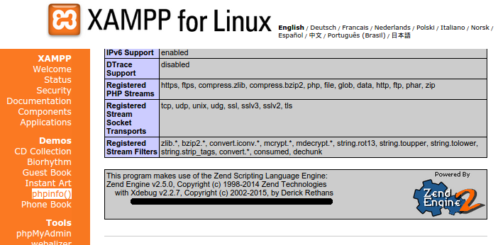

Setting up the development environment
--------------------------------------

We will start by setting up all the essentials required by coreERP for the development environment. This
setup is done on a ubuntu Linux distribution - Ubuntu Desktop 18.04LTS. If your machine has some other 
version of Linux or Windows, the installation steps would be a little different. In that case, you can refer to the 
particular component web site and use the respective site as a guide.

All components required by coreERP are either Open Source or Free software. You may read the respecive licenses before installation.

Install lampp
~~~~~~~~~~~~~

Lampp(xampp) is a popular distribution of Apache, mysql, php and proFTP. This is required on the local machine to deploy and test the 
development code of coreERP. 

    * Download `xampp for linux <http://sourceforge.net/projects/xampp/files/XAMPP%20Linux/5.6.8/xampp-linux-x64-5.6.8-0-installer.run/download>`_
    * Right click on the downloaded file and set the 'Allow file to execute as program' property to true. 
    * Go to a shell and run the downloaded file with sudo previleges. ``$ sudo ./<downloadedfile>``
    * A wizard would guide you through the installation.
    * Start XAMPP (Apache only) ::
        $ /opt/lampp/lampp startapache
    
    * Open your browser and browse ``http://localhost``. This should show you the xampp welcome screen.

Familiarise yourself with the xampp installation. Click on **phpinfo()** to view php settings and the installation folder.

Add Xdebug to php ini
~~~~~~~~~~~~~~~~~~~~~

To debug php projects, we need xdebug. This is already a part of xampp installation. This would be the lampp default folder. If you have changed it during install, 
please go to the appropriate folder. Let us try to find it. ::

    $ /opt/lampp/lib/php/extensions/

This should contain a folder named ``no-debug-non-zts-<YYYYMMDD>``. e.g. ``no-debug-non-zts-20121212``. You would find a file called **xdebug.so** inside `no-debug...` folder. 

Find the path of php.ini using the web browser ``http://localhost``. Click on phpinfo(). 

Look for **Loaded Configuration File**. It would usually be ``/opt/lampp/etc/php.ini``. Lets edit this file to include xdebug ::

    $ sudo gedit /opt/lampp/etc/php.ini

Scroll the end of the file and insert the following lines:

.. code-block:: php

    [xdebug]
    zend_extension = "<Path To Replace>/xdebug.so"
    xdebug.remote_enable = 1
    xdebug.remote_handler = "dbgp"
    xdebug.remote_host = "localhost" 
    xdebug.remote_port = 9000
    
Change the <Path To Replace> with the entire path that you had found previously for xdebug.so. e.g. ``/opt/lampp/lib/php/extensions/no-debug-non-zts-........``

.. warning ::
    If you have entered an incorrect path, you will not get any error. The xdebug will simply not show up in the screen after restart of apache.

Save and close the file. Restart apache. ::

    $ sudo /opt/lampp/lampp stopapache
    $ sudo /opt/lampp/lampp startapache

Click on phpinfo(). Look for `Zend Technologies with Xdebug`. It should show you the following:

    

Install Java
~~~~~~~~~~~~

Java is required for the report server/designer component. It can be installed using the following command ::

    $ sudo apt-get install openjdk-8-jdk

Install Netbeans 8.2
~~~~~~~~~~~~~~~~~~~~

Netbeans IDE is used as code editor for coreERP. The project files in the source are maintained in netbeans format. Since 
coreERP is written primarily in php, we will use the PHP distribution of netbeans.

    * Download `Netbeans for PHP <http://download.netbeans.org/netbeans/8.0.2/final/bundles/netbeans-8.0.2-php-linux.sh>`_
    * The downloaded file would be `NetBeans-8.x.x-php-linux-sh`.
    * Right click on the downloaded file and set the 'Allow file to execute as program' property to true.
    * Open the bash shell (ctrl+alt+T) and run the shell script file using bash (./) command. ``$ sudo ./netbeans-8.0.2-php-linux.sh``
    * A wizard will guide you through the installation.

The following step is required for compiling the war file used by the report server. If you do not plan to compile or open the CoreReportServer project, you may skip this step. This would take a considerable amount of time to download and install.

Start Netbeans from the shortcut created on the desktop or from the launch pad. 

    * Click on the menu and goto ``Tools -> Plugins -> Available Plugins``
    * Select all items from the category ``Java Web and EE``

Install PostgreSQL
~~~~~~~~~~~~~~~~~~

PostgreSQL is the database server that is used by coreERP. We will setup the database server instance on the local machine
along with the admin tools. ::

    $ sudo apt-get install postgresql-12 pgadmin4

Let us now configure PostgreSQL server for authentication, timezone, etc. ::

    $ cd /etc/postgresql/12/main
    $ sudo nano pg_hba.conf

Search for the following lines

.. code-block::

        Enable *Database administrative login for unix socket* as follows
        local     all     postgres        peer

Change from 'peer' to `trust`.
Save and close file changes (ctrl+o, Enter, ctrl+x) ::

    $ sudo service postgresql restart

this would restart the service.

    .. warning:: You have now opened postgres login to allow access to database without password from local machine. We will fix this in a moment.

Login into psql client and set the user *postgres*  password ::

    $ psql -U postgres
    =#: \password postgres

it will prompt you for new postgres password. Set this and also **remember** it ::

    =#: \q

will exit to shell.

Change the database login from trust to md5. This will ensure that users can login only with a password. Trusted connections are no longer allowed. ::

    $ sudo nano pg_hba.conf

again edit the hba_conf file. Search for the following: ::
    
    Enable *Database administrative login for unix socket* as follows
    local     all     postgres        trust

    # "local" is for Unix domain socket connections only
    local   all             all       peer

change this from `trust` and `peer` to `md5`. Please make changes to both the lines. Your new changes will appear as follows ::

    Enable *Database administrative login for unix socket* as follows
    local     all     postgres        md5

    # "local" is for Unix domain socket connections only
    local   all             all       md5

Save and close file changes (ctrl+o, Enter, ctrl+x). ::

    $ sudo service postgresql restart 

will restart postgreSQL.
            
.. note:: we have now ensured that user *postgres* can login only with a password.

Install Jaspersoft Report Designer
~~~~~~~~~~~~~~~~~~~~~~~~~~~~~~~~~~

Reports in coreERP are created using Jaspersoft Reports. This is again a Open Source product and also has a designer to assist 
in easy report creation.

    * Download `Jaspersoft Studio 6  <https://community.jaspersoft.com/project/jaspersoft-studio/releases`_
    * Unzip it to a folder. You can use any unzip utility.

Install git
~~~~~~~~~~~

git is the distributed version control system. coreERP is maintained on github. This site provides for hosting git repositories, forking and cloning.

    $ sudo apt-get install git

