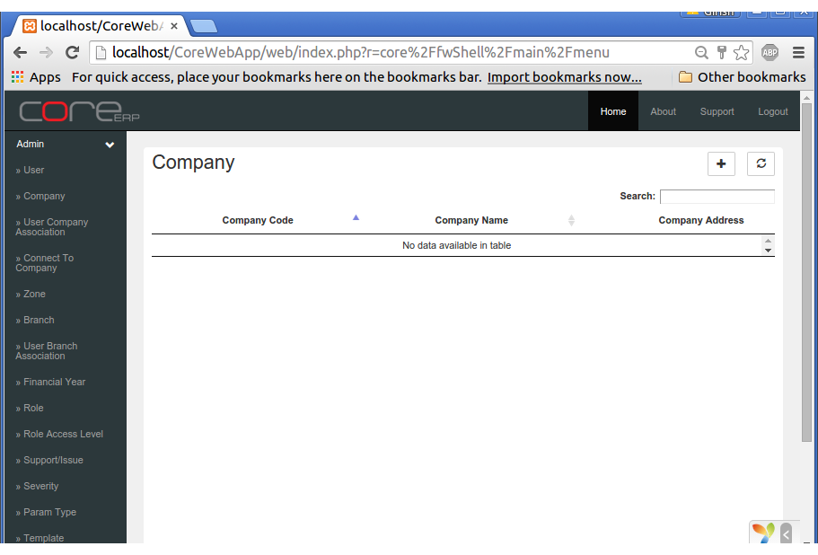

Company
=======

Every Business Entity or Legal Entity is defined as a **Company** in CoreERP. All the masters like Chart Of Accounts, Suppliers, Customers, etc. belong to a company. It is the root for all financial transactions in a predefined financial period. Every company requires to have at least one :any:`Branch <branch>` and one :any:`Financial Year <finyear>` to begin with. Business transactions are recorded as part of the branch and belong to a financial year. We start by defining a company. 

Click on the menu item **Company**. If it is not visible, click on Admin to expand the menu group.

A list of Companies would be displayed. Since this is our fresh installation, there are no companies available.

Clicking on a master or document menu item always brings up a list. The left top mentions the name of the list.
On the right hand side you will see two buttons. 

                .. image:: images/addRefreshButton.png

    - The first **+** button stands for adding a new item.
    - The second refresh button with a `circle of two arrows` can be clicked to refresh the list.
    - The search text box accepts any input and filters the list for the entered text. This is helpful when you have large lists to filter/search.

Click on the **+** button. It will display a combination of labels and text boxes for data entry. We would be required to fill in all the fields to create a new company.

    .. image:: images/companyCreate.png

    - The caption displays the list being edited
    - The three buttons on the right hand side, display the actions acclowed to the user. 

                .. image:: images/saveNewCloseButton.png

    - Clicking on **Save** will save the item/document to the database on the server
    - **+ New** is to add a new item
    - **X Close** is to close the edit screen and return to list view

Each field is explained in the following table.

==================  =============   ===============================================
Field Name          Required        Description
==================  =============   ===============================================
Code                Yes             A two digit alpha numeric code for the company. Duplicates not allowed.
Name                Yes             Full name of the company or legal entity
Short Name          Yes             Short name that is displayed on CoreERP Home page
Company Address     Yes             Mention the complete address here. This would be the address of the first branch also
Branch Code         Yes             A two digit alpha numeric code for the branch
Branch Name         Yes             Short Branch name. Usually the city/location of the branch
Branch Description  Yes             Full name of the branch
Currency            Yes             Base currency of the company. e.g. Rupees or US Dollars
Sub Currency        Yes             The sub currency of the base currency. e.g. Paise or cents
Currency Displayed  Yes             A short name for the currency to appear in reports. e.g. INR or USD
Currency System     Yes             Select from *Lakhs* or *Millions*
Date Format         Yes             Supports one of the following: dd/mm/yyyy, dd-mm-yyyy, mm/dd/yyyy, mm-dd-yyyy
Fin Year            Yes             Four digit financial year code. e.g. *1415* for year begining on 01 Apr, 2014 and ending on 31 Mar, 2015
Year Begin          Yes             First day of the financial year
Year End            Yes             Last day of the financial year 
Server Messages     Read Only       This would display a list of messages on the server while creating a new company. Any errors/status of creating would be displayed here.
==================  =============   ===============================================

Enter information relating to each field and click on **Save**. If you have left any *required* field empty, the system would display a list of *Business Rules* on **Save**.
If all data is entered properly, a toast message would display *Successfully saved*. 

:Note:
    
    In the *Server Messages* you would get to see a list of messages. This displays the status of executing scripts for creation of a new company.
    If there were any errors at time of creation, these would be displayed here. Else, it would display information regarding successful execution
    of scripts.

Click on **Close** to return to the company list. It would display the new company created.

