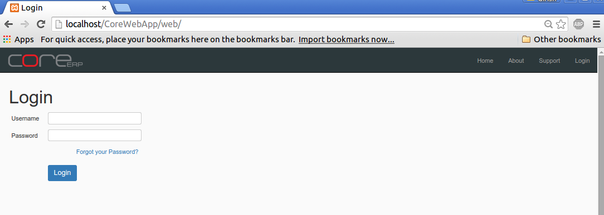

Getting Started
===============

We will start by familiarising ourselves with CoreERP. While installing the application, you would have used plenty of commands and shell directives. Henceforth, everything would be via the CoreERP web interface. 

Login
-----

CoreERP has 2 types of logins:

    - Administrative Login
    - User Login

Even though, both logins start from the same login screen, their purpose is very different. The Administrative login is used for certain specific purposes and would be discussed as part of this document. 

Let us start by opening the login screen. If all steps in **Server Setup Guide** and **Install and Configure CoreERP** were followed properly, the login screen should come up without any issues. Open a browser and type the following link: ::

    http://<remote-ip>/core-erp

Enter username: ``super-user`` [This was mentioned while setting up cwfconfig.php->suName]

Enter Password: ``password`` [This was mentioned while setting up cwfconfig.php->suPass]

:Note: 
    At the time of install and config, if you have mentioned a different *suName* and/or *suPass*, replace it accordingly.
    The username and password would be the admin user name with super user privileges. This user can do very restricted but highly privileged and sensitive work.

Click on **login** to proceed. The system would authenticate the admin user and display the following home page.

    .. image:: images/home-page.png

If we start from the left hand top corner, we see the CoreERP logo. Clicking on this logo, will take you to the *Company -> Branch -> Financial year* selection. You can change your selection without logging out of the system.

Just below the logo, would be the *menus*. The *menus* are loaded based on the access level assigned to the user and the modules activated in the system. Any new activity in CoreERP starts from these menus.

The text, right beside the logo displays the *Company, Branch and Financial Year* that you are connected to. This would appear for admin only after he connects to company.

There are a few quick links on the right hand side. Clicking on *Home* brings you to this home page. 

**About** provides a brief about the organisation that is behind the development and maintenance of CoreERP.

**Support** can be used to submit any issue relating to CoreERP. The system would automatically generate a ticket and connect the issue to the support/maintenance team. Do remember to use this if you run into problems using the system.

**Profile** lets you change your password and other user settings.

Clicking on **Logout** would log you out of the system and return you to the login page. Remember to click this after you have completed your work and would like to exit the system.

