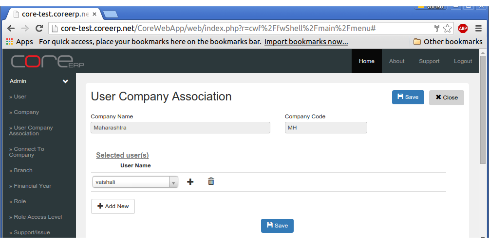
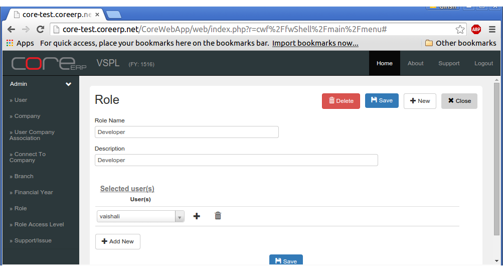

User And Role
=============

As the name suggests, *User* is a end user who is allowed login into CoreERP. These are normal users who can create/edit masters, create/edit/post transactions.
CoreERP follows the principle of creating *Roles* and assigning *Access Levels* to each *Role*. *User* inturn belongs to a single or multiple *Roles*. 
When a user belongs to multiple *Roles*, the *Role* that provides him the highest previlege superseeds all other *Access Levels* for the same master/document 
accross *Roles*. This facilitates ease of maintenace when you are required to retire a user and/or change his access levels. 

User
----

In CoreERP, User is at the level of *System*. A *user*, once created, is available accross companies. 
 
    - To create a new user, click on **User** in the Admin menu
    - The *User* list would appear. Click on **+** button

    .. image:: images/userCreate.png

Each field is explained in the following table:

==================  =============   ===============================================
Field Name          Required        Description
==================  =============   ===============================================
User Name           Yes             This is the User's login name. System wide duplicates are not allowed
Password            Yes             This is the password with which the user can login
Confirm Password    Yes             This should be the same as password
Full User Name      Yes             Mention the User's Full Name here
Email Address       Yes             Mention User's Email address. This is required for sending notifications, Forgot Password link, etc.
Active              Yes             Toggle this to deactivate the user. Only active users are allowed to *login*
==================  =============   ===============================================

After entring data for all fields, click on *Save*. 

If you want to create more *users*, click on **+ New** and enter information for more users.

Every *User* created needs to be associated with a :any:`Company <company>`. It is only after this association, that the User-Role-Company association is activated in the system and the user gets to select the company after login.

    - Click on **User Company Association**
    - It will open the list of Companies. Click on **Edit** link to add users' to the company
    - Click on **+ Add New** and select the user from the drop down.
    - To remove a user, click on the |deleteImage| image next to the user name. 
    - Click on **Save**. 

.. warning:: Always remember to click on |saveImage| to **Save** your changes. If you **Close** without saving, your changes will be ignored.
    
.. |saveImage| image:: images/save.png

Role
----

In contrast to a *User*, **Roles** are created inside a Company. Therefore, we will first connect to a Company. Since, you have logged in as the Admin/Superuser, you would be provided with a list of all companies available in the system.

    - Click on **Connect To Company**
    - Select your company
    - Select the top most *Financial Year*

CoreERP would reload all the menus and display the connected company on top (right next to the logo).

    - Click on **Role**. The role list would appear.
    - Click on **+** to add a new role
    
Role fields are explained in the following table:

==================  =============   ======================================================
Field Name          Required        Description
==================  =============   ======================================================
Role Name           Yes             This is the Role name. Duplicates are not allowed
Description         Yes             Describe the Role. Helps explain the role name.
==================  =============   ======================================================

    :Select user(s): These are the users who belong to the role.

    - Click **+ Add New** to include users in this role
    - Click **Save**

You have only included users in a role within a company. The next topic explains Access levels.

