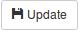
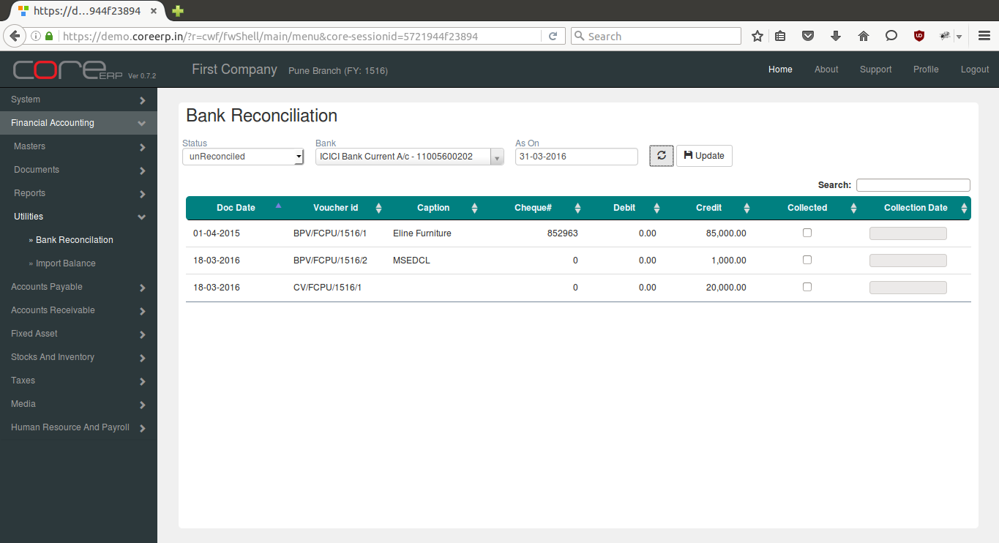

Bank Reconciliation
-------------------

The Bank Reconciliation is possible with the Bank Account data entered by the user and reconciling it with the Bank Statement received from the bank at regular intervals.
This allows user to reconcile items for the selected bank till As On date. The items are then displayed for reconciliation.

Click on the menu *Financial Accounting -> Utilities -> Bank Reconciliation*.

The following screen should appear.

Select the option from *Status* drop down which include unReconciled, Reconciled and All options. By default unReconciled is selected.

Select Bank Account.

Select *As On* date. By default it will show the today's date.

Clicking on |RefreshImage| will display the list of *Authorised* vouchers entered for the selected Bank.

If the details of the vouchers as in the Bank Statement matches with the vouchers entered by the user while making entries, click on the checkbox in the *Collected* column.

Select proper Collection Date and click |UpdateImage| to update the record.

