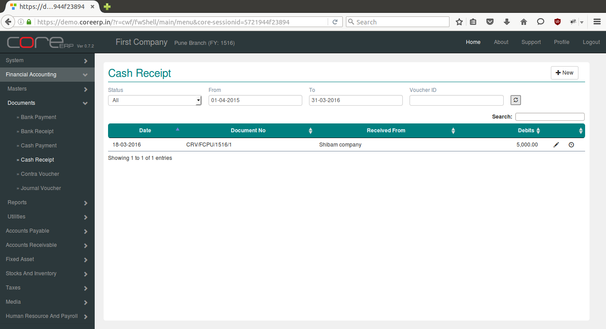
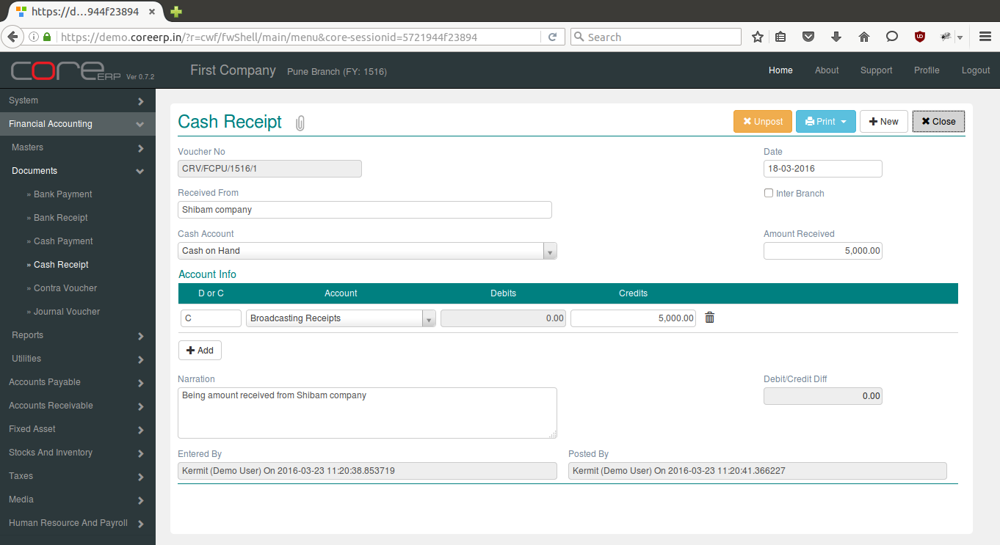

.. |newImage| image:: images/button-new.png
.. |saveImage| image:: images/button-save.png
.. |postImage| image:: images/button-post.png
.. |deleteImage| image:: images/button-delete.png
.. |unpostImage| image:: images/button-unpost.png

Cash Receipt
------------

Cash Receipt Voucher enables user to book amount received in Cash.

Click on the menu *Financial Accounting -> Documents -> Cash Receipt*.

The following screen should appear. This is the Cash Receipt Collection.

You can create a new Cash Receipt by clicking on |newImage|

The fields are explained in the following table:

=======================		 =============   ===============================================
Field Name          		 Required        Description
=======================		 =============   ===============================================
Voucher No       		 No              This is a system generated field. 
                       	               	 	 (*Format - VoucherAlias/Branch Alias/FinYear Alias/Sequence Number*)
Date                	  	 Yes             The Voucher Date. By default, the system date is taken as Voucher Date.
						 Note : The date should be within the constraints of the Financial Year.
Received From          	 	 No              The Party name or name of person from whom the amount has been received.
Inter Branch        	 	 No              Select this option to make interbranch payment.
Cash Account        		 Yes             Account from which amount is to be debited.
Amount Received        	 	 Yes             Amount to be debited to Cash Account. This is the net amount for which the payment is dispersed.
Account Info - D or C	  	 Yes             D - Debit, C- Credit
Account Info - Account    	 Yes             Ledger Account - Account to which amount is to be credited/Debited based on *D or C*.  
Account Info - Debits     	 Yes             Amount to be debited to the ledger account. Required if *D or C * is *D*.
Account Info - Credits    	 Yes             Amount to be credited to the ledger account. Required if *D or C * is *C*.
Narration                 	 No              This is an optional field. Press Ctrl **+** A to bring the default narration - *Being amount received from (Received From)*
Debit/Credit Diff        	 No              This will show the Credit and Debit total Difference.
=======================		 =============   ===============================================

Click on |saveImage| to save your changes.

Click on |postImage| to change status of the voucher and close. The Cash Receipt Collection will now display the newly created Bank Payment.

Click on |deleteImage| to delete the saved voucher. This will permanently delete the voucher from the system. Posted voucher cannot be deleted.

To delete posted voucher, unpost them by clicking on |unpostImage| Then delete the voucher.
