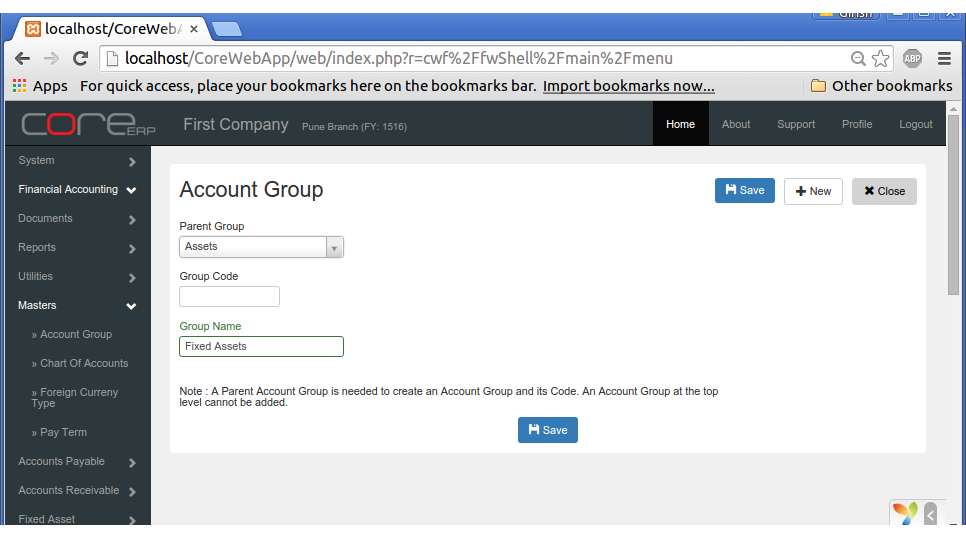
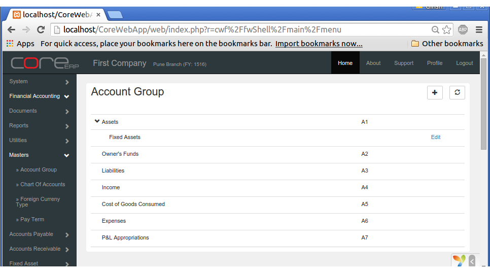

.. |saveImage| image:: images/button-save.png

Chart Of Accounts
-----------------

A Chart of Accounts is the basic requirement of any accounting system. This is hierarchical in nature and is a combination of Account Groups, Account Heads and Account Types. 
It is very important to understand the correlation between all these three elements. We will explain in detail each of the elements and then the correlation between them.

Account Group
~~~~~~~~~~~~~

A group of accounts that need to be presented together and represented hiearchically can be achieved by creating Account Groups. The following are account groups at the basic level with their legends.

======  ====================== ==============================
Legend  Account Group          Group Type
======  ====================== ==============================
A       Assets                 Balance Sheet
O       Owner's Funds          Balance Sheet
L       Liabilities            Balance Sheet
I       Income                 Profit & Loss 
C       Cost of Goods Consumed Profit & Loss
E       Expenses               Profit & Loss
P       P&L Appropriations     Profit & Loss (Below the line)
======  ====================== ==============================

The first three groups, namely **Assets, Owner's Funds, Liabilities** are groups whose balances would be carried forward at the end of the Fiscal/Financial Year. Meaning, any **Account Head** created 
within these groups or any of their child groups would become part of the *Balance Sheet* and treated accordingly for carry forward of balances from one Fiscal Year to another. 

The rest of the groups, **Income, Cost of Goods Consumed, Expenses, P&L Appropriations** would be closed at the end of the Fiscal/Financial Year and transferred to the **Profit & Loss Account**. 
Only the net profit/loss would be carried forward to the Balance Sheet.

These are the root groups in the Chart Of Accounts. You cannot add or edit any of these groups. Any new group created must belong to one of these groups. 

Click on the menu *Financial Accounting -> Masters -> Account Group*.

The following screen should appear.

You can create a new group by clicking on **+**.

Since Account Group follows a parent-child hierarchy, you need to select a parent group and mention the group name for the newly created group.

An example group called *Fixed Assets* created under the parent *Assets* would appear as follows:

The fields are explained in the following table:

==================  =============   ===============================================
Field Name          Required        Description
==================  =============   ===============================================
Parent Group        Yes             Select an already existing group
Group Code          No              This is an optional code of 10 alphabets
Group Name          Yes             The Group Name to be created or edited
==================  =============   ===============================================

Click on |saveImage| to save your changes and close. The Group chart will now display the newly created group inside the parent group.

You can create any number of groups at any level except for the root level. 

Account Head
~~~~~~~~~~~~

An Account head represents a ledger which records all transactions within it. An Account Head's behaviour is driven by the Account Type that you select while creating an Account Head.
Each Account Type has a specific treatment attributed to it in CoreERP. It is therefore very important to understand the implications of creating an Account Head of the particular Account Type. 
Once an account of a particular type is created, the type of that account cannot be altered.

An Account Head can only be created in one of the Account Groups. The Account Head would inherit the attributes of the top most parent group. e.g. An Account head created inside Assets (at any level)
would always be balanced at the end of the financial year and the closing balance is carried forward to the next financial year.

Let us now understand various Account Types and their usage when creating a new Account head.

==== =============================== ============= ========= =====================================================================================================
Code Account Type                    Group Usage   Txn. Type Explanation
==== =============================== ============= ========= =====================================================================================================
1    Bank                            A, L          U          All types of Bank Accounts except Fixed Deposits.
2    Cash                            A             U          Cash Accounts including petty cash
3    Others - Generic                A, O, L, I, E U          Accounts not of any other specific type. This is the most generic in nature
6    Inventories                     A             S          Inventory Accounts that can be associated with Stock Items for inventory valuation
7    Debtors                         A             S          This is hidden and used by the system to create Customers
9    Capital                         O             U          Could be Share Capital, Capital Fund, etc.
12   Creditors                       L             S          This is hidden and used by the system to create Suppliers
13   Other Liabilities               L             U          Can be used for Landed Cost in Stock Purchase
15   Retained Earnings               O             U          Used for Carry Forward of Balances (automated adjustments)
16   Fixed Assets                    A             S          Accounts associated to Asset Class for Fixed Assets
18   Sales                           I             U          Sales Accounts for Stock Invoice
21   Direct Expenses                 C             U          Accounts that can be used for booking direct expenses
22   Indirect Expenses               E             U          Accounts that can be used for booking all other expenses 
23   Direct Income                   I             U          Income Accounts Service Invoice
25   Inventory Consumption           C             S          Inventory Accounts that can be associated with Stock Items for inventory consumption  
30   Profit & Loss A/c               L             U, S       P/L adjustments for the Fiscal Year
42   Depreciation                    E             S          Accounts associated to Asset Class for depreciation
43   Accumulated Depreciation        A             S          Accounts associated to Asset Class for Accumulated Depreciation
44   TDS Payable (Other Liability)   L             S          Association for Tax Deduction/witholding
45   Inter Branch                    A, L          S          Control A/c - used for Inter-branch transactions
46   Bills Receivable Control        A             S          Control A/c - Used for representing Customers in Trial Balance
47   Bills Payable Control           L             S          Control A/c - Used for representing Suppliers in Trial Balance
==== =============================== ============= ===============================================================================================================

Txn. Type Legends
    - U : User transactions allowed
    - S : System would post automatic transactions. user Transactions are not allowed

Association with various Documents 
==================================

| Module Documents              | Filters Applied
Financial Accounting
    Bank Payment
        Header                  | 1
        Line Items              | 3, 9, 13, 21, 22
    Bank Recipt                 
        Header                  | 1
        Line Items              | 3, 9, 13, 21, 22
    Cash Payment
        Header                  | 2
        Line Items              | 3, 9, 13, 21, 22
    Cash Receipt
        Header                  | 2
        Line Items              | 3, 9, 13, 21, 22

