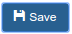
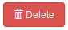
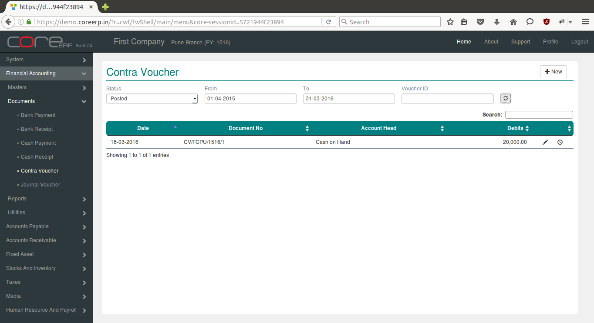
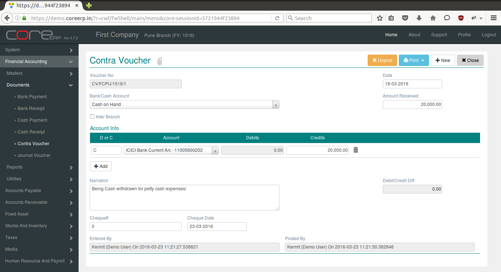

.. |newImage| image:: images/button-new.png

Contra Voucher
--------------

All entries between Cash, Petty Cash and Bank are affected through the Contra Voucher. 
Whenever cash is withdrawn from the bank or cash is depositted into the back or funds transferred between banks, a contra voucher is prepared.

Click on the menu *Financial Accounting -> Documents -> Contra Voucher*.

The following screen should appear. This is the Contra Voucher Collection.

You can create a new Contra Voucher by clicking on |newImage|

The fields are explained in the following table:

=======================		 =============   ===============================================
Field Name          		 Required        Description
=======================		 =============   ===============================================
Voucher No       		 No              This is a system generated field. 
                       	               	 	 (*Format - VoucherAlias/Branch Alias/FinYear Alias/Sequence Number*)
Date                	  	 Yes             The Voucher Date. By default, the system date is taken as Voucher Date.
						 Note : The date should be within the constraints of the Financial Year.
Inter Branch        	 	 No              Select this option to make interbranch payment.
Bank/Cash Account      		 Yes             Account which has received funds.
Amount Paid         	 	 Yes             Amount to be debited. This is the net amount for which the payment is dispersed.
Account Info - D or C	  	 Yes             D - Debit, C- Credit
Account Info - Account    	 Yes             Ledger Account - Account to which amount is to be credited/Debited based on *D or C*.  
Account Info - Debits     	 Yes             Amount to be debited to the ledger account. Required if *D or C * is *D*.
Account Info - Credits    	 Yes             Amount to be credited to the ledger account. Required if *D or C * is *C*.
Narration                 	 No              This is an optional field. Press Ctrl **+** A to bring the default narration - *Being amount paid to (Paid To)*
Debit/Credit Diff        	 No              This will show the Credit and Debit total Difference.
Cheque#                   	 No              The cheque # through which the payment is dispersed.
Cheque Date               	 No              The date that is mentioned on the cheque leaf issued to the party.
=======================		 =============   ===============================================

Click on |saveImage| to save your changes.

Click on |postImage| to change status of the voucher and close. The Contra Voucher Collection will now display the newly created Bank Payment.

Click on |deleteImage| to delete the saved voucher. This will permanently delete the voucher from the system. Posted voucher cannot be deleted.

To delete posted voucher, unpost them by clicking on |unpostImage| Then delete the voucher.
