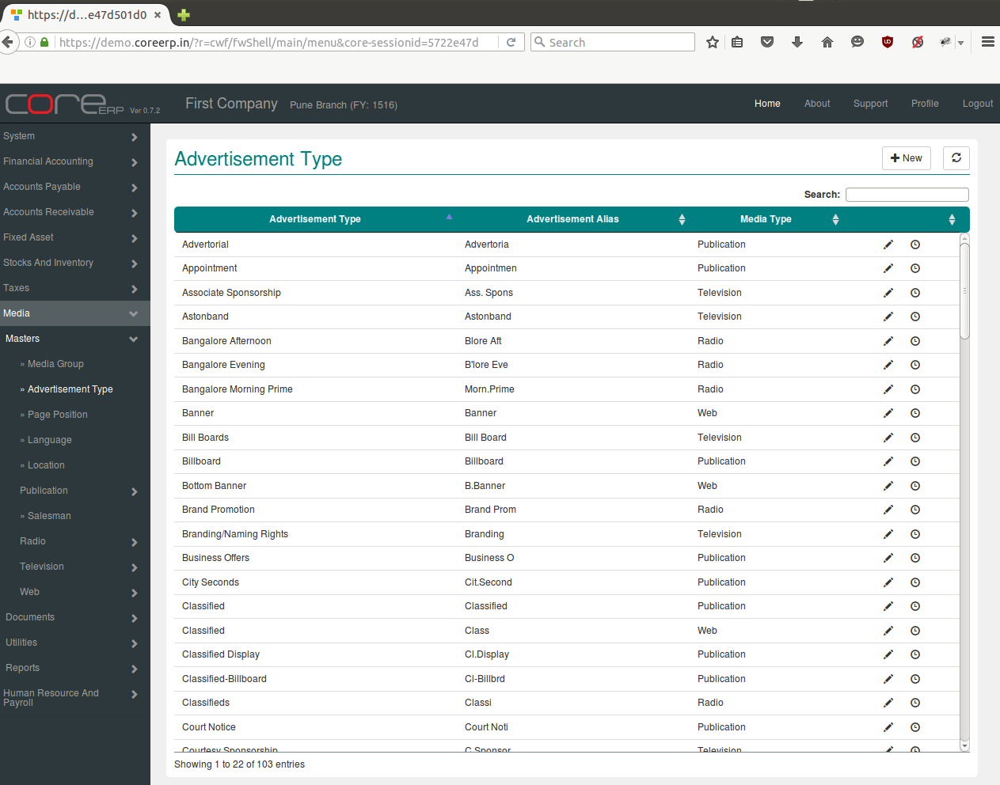
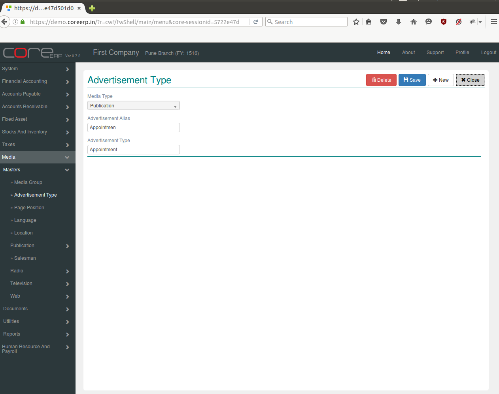

.. |newImage| image:: images/button-new.png
.. |saveImage| image:: images/button-save.png

Advertisement Type
------------------

Advertisements are segregated on the basis of the purpose or message that is spread through them. These could be categorised as appointment, Notice, Tender, Display etc. The charges may differ for different types of advertisement.

Click on the menu *Media -> Masters -> Advertisement Type*.

The following screen should appear. This is the Advertisement Type Collection.

You can create a new Advertisement Type by clicking on |newImage|

The fields are explained in the following table:

=======================		 =============   ===============================================
Field Name          		 Required        Description
=======================		 =============   ===============================================
Media Type       		 Yes             Select Media Type (e.g. Publication, Radio, Television, Web).    
Advertisement Alias              Yes  	  	 Enter Advertisement Alias e.g. Display, Tender etc.
Advertisement Type            	 Yes             Enter Advertisement Name e.g. Appointment, Entertainment etc. 
=======================		 =============   ===============================================

Click on |saveImage| to save your changes.

