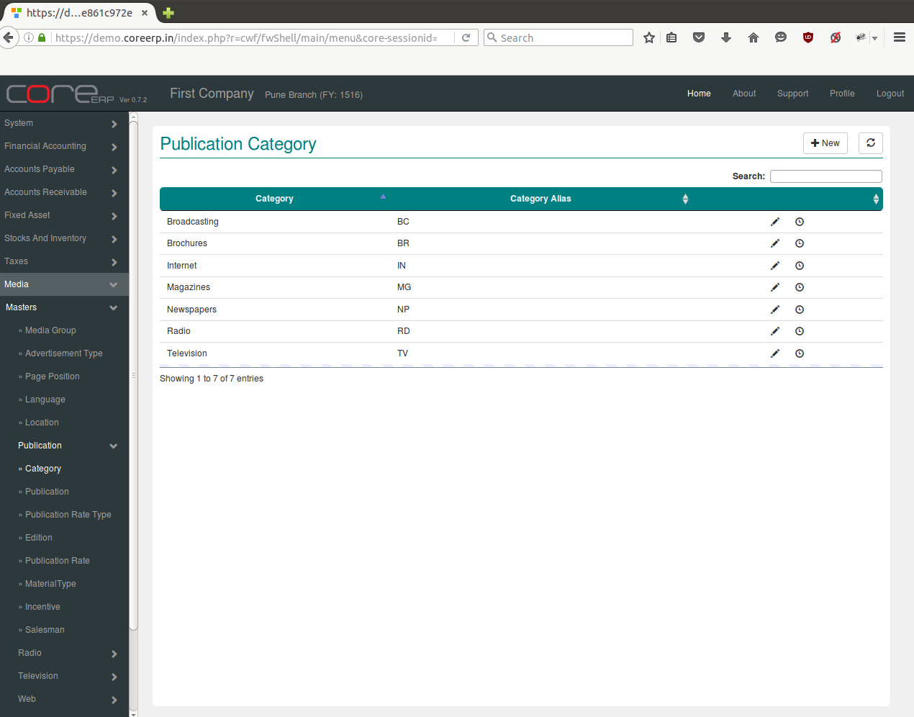
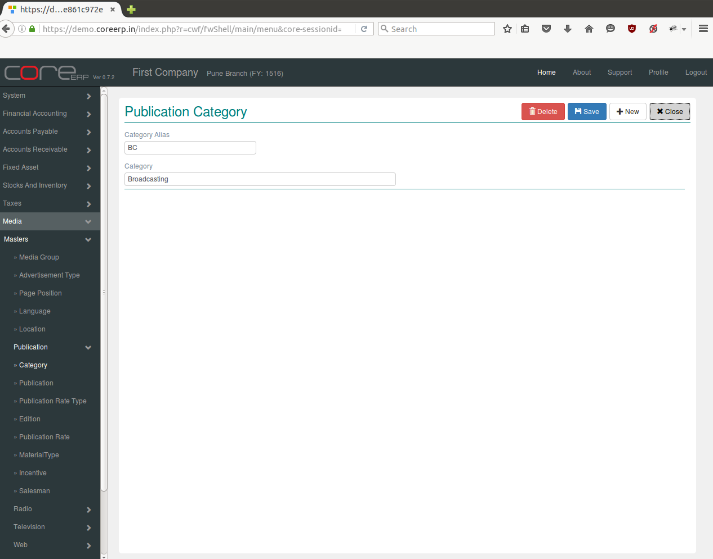

.. |newImage| image:: images/button-new.png
.. |saveImage| image:: images/button-save.png

Category
--------

Advertising is a very vast activity spanning different mediums of communication. With the fast changing technologies and inventions of new forms of mass communication it is imperative to categorise the advertisements according to the medium through which they will be promoted. This categorisation will help in tracking the advertisement and make the job of recording and retrieving it less cumbersome.

Click on the menu *Media -> Masters -> Publication -> Category*.

The following screen should appear. This is the Category Collection.

You can create a new Category by clicking on |newImage|

The fields are explained in the following table:

=======================		 =============   ===============================================
Field Name          		 Required        Description
=======================		 =============   ===============================================
Category Alias       		 Yes             Select Category Alias e.g. BC, BR etc.    
Category                         Yes  	  	 Enter Category e.g. Broadcasting, Broucheres etc.
=======================		 =============   ===============================================

Click on |saveImage| to save your changes.

