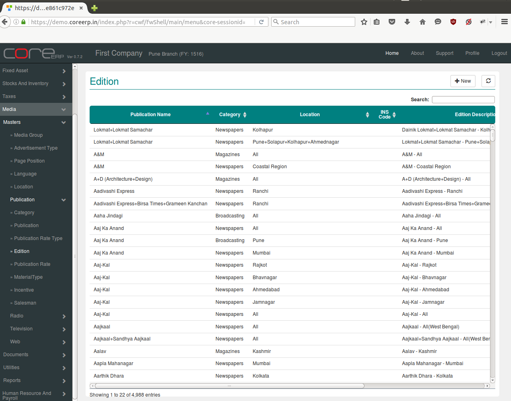
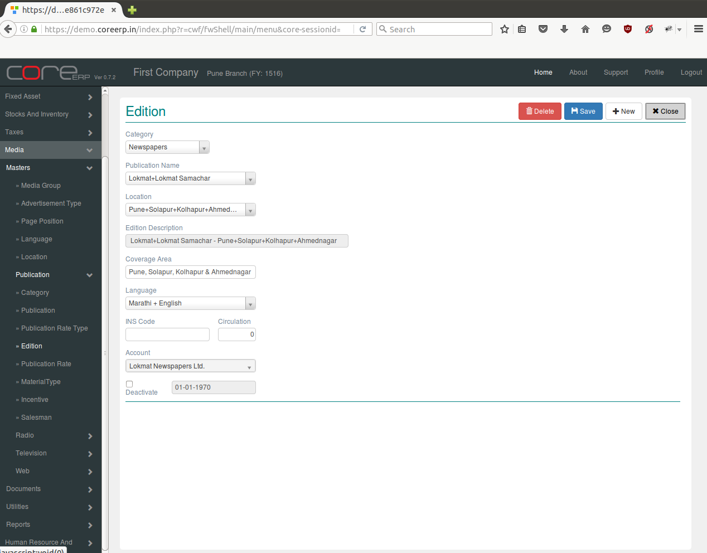

.. |newImage| image:: images/button-new.png
.. |saveImage| image:: images/button-save.png

Edition
-------

A publication may be published from different locations. Each edition may have different tariff rates depending upon the rates decided by the Publication. Edition belongs to a particular Publication.

Click on the menu *Media -> Masters -> Publication -> Edition*.

The following screen should appear. This is the Edition Collection.

You can create a new Edition by clicking on |newImage|

The fields are explained in the following table:

=======================		 =============   ===============================================
Field Name          		 Required        Description
=======================		 =============   ===============================================
Category       		         Yes             Select Category e.g. Broadcasting, Brochures etc.
Publication Name                 Yes             Select Publication Name e.g. The times of India, Filmfare etc.
Location                	 Yes             Select Location e.g. Agra, Adyar etc.
Edition Description              No	 	 Edition description of selected location. Non-editable field.  
Coverage Area        	 	 Yes             Enter coverage Area of edition.
Langauge                         Yes             Select Langauge e.g. marathi, gujarathi etc.
INS Code                         No              
Circulation                      Yes             No of copies
Account                          No              Edition payable account
Deactive                         No              Account Deactivation Date. Select to deactivate the account. 
=======================		 =============   ===============================================

Click on |saveImage| to save your changes.

