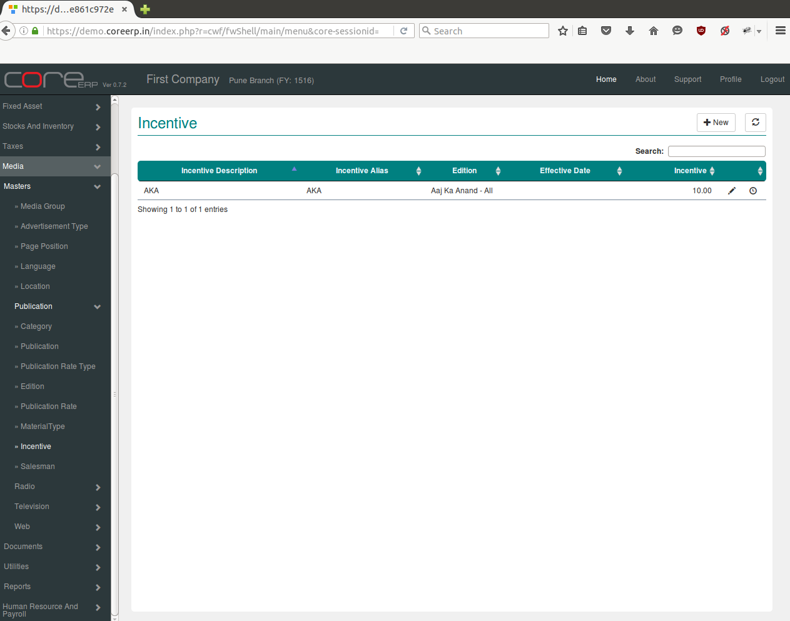
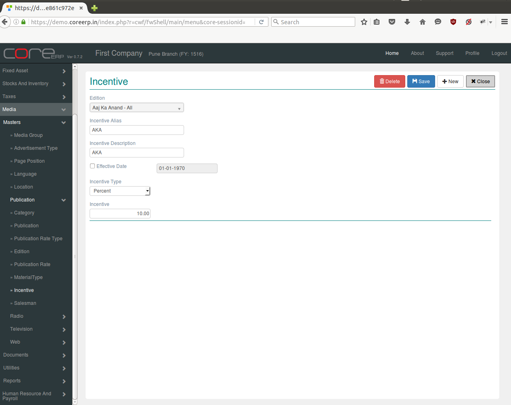

.. |newImage| image:: images/button-new.png
.. |saveImage| image:: images/button-save.png

Incentive
--------------

Incentives are given by publications for particular type of advertisement.

Click on the menu *Media -> Masters -> Publication -> Incentive*.

The following screen should appear. This is the Incentive Collection.

You can create a new Incentive by clicking on |newImage|

The fields are explained in the following table:

=======================		 =============   ===============================================
Field Name          		 Required        Description
=======================		 =============   ===============================================
Edition           		 Yes             Select Edition
Incentive Alias                  Yes    	 Enter Incentive Alias
Incentive Description            Yes             Enter Incentive Description 
Effective Date                   Yes             The Effective Date. By default, the system date is taken as effective Date.
Incentive Type 		         Yes	         Select  Incentive Type as percent or value
Incentive			 Yes	         Incentive value 	 
=======================		 =============   ===============================================

Click on |saveImage| to save your changes.

