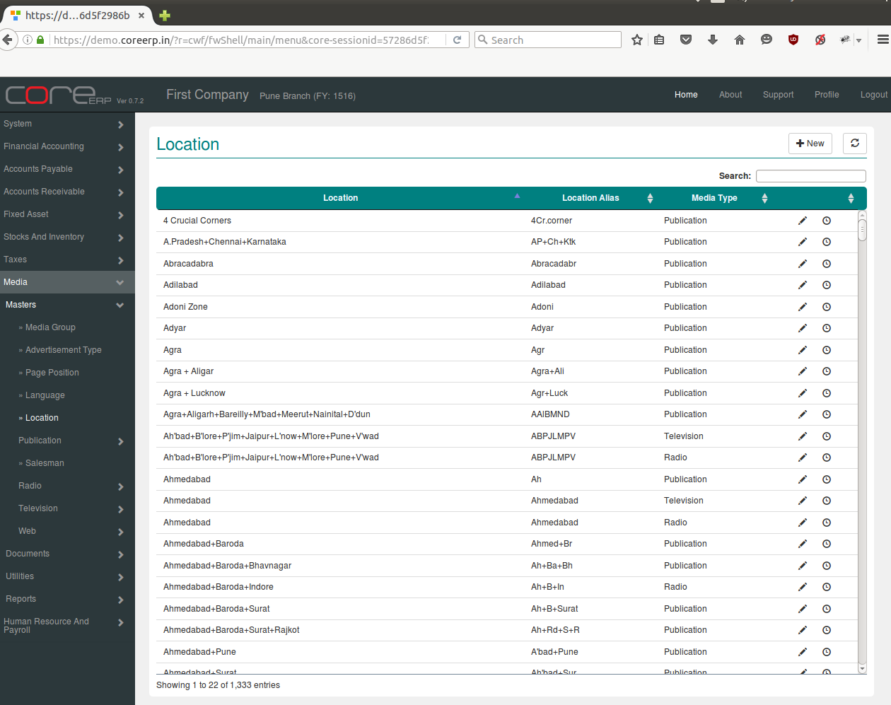
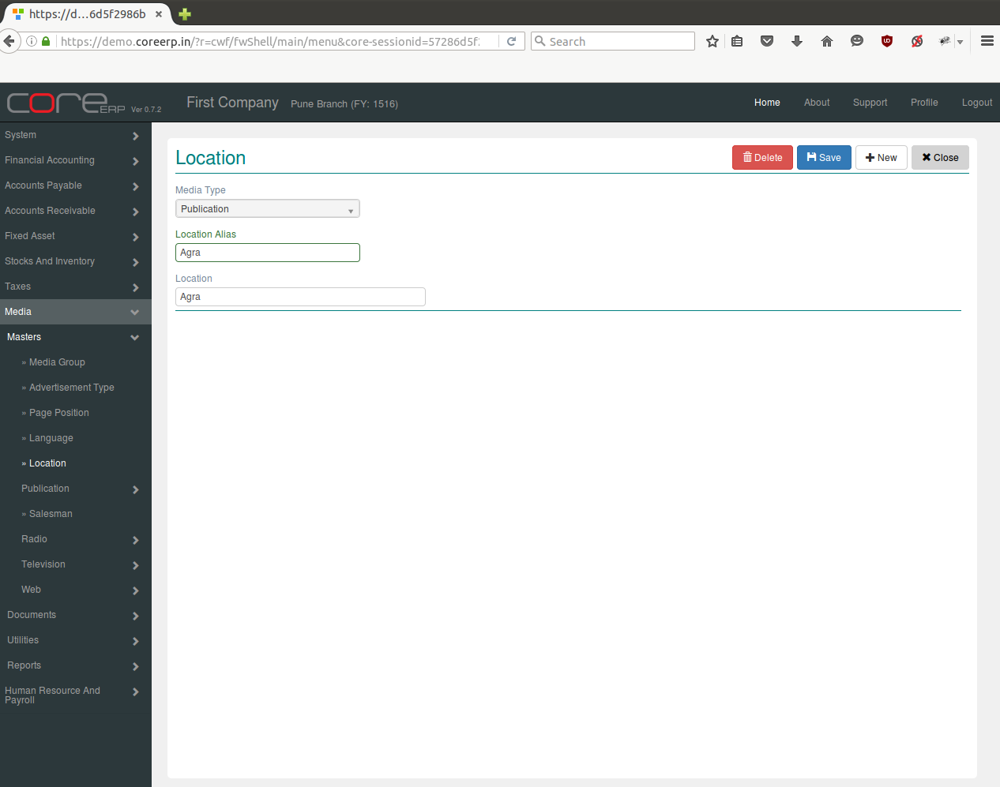

.. |newImage| image:: images/button-new.png
.. |saveImage| image:: images/button-save.png

Location
--------

Location is the place from where an edition is published. Locations have to be specified before an edition can be created for a publication.

Click on the menu *Media -> Masters -> Location*.

The following screen should appear. This is the Location Collection.

You can create a new Location by clicking on |newImage|

The fields are explained in the following table:

=======================		 =============   ===============================================
Field Name          		 Required        Description
=======================		 =============   ===============================================
Media Type      		 Yes             Select Media Type e.g. Publication, Radio, Television, Web.
Location alias                   Yes    	 Enter Location Alias e.g. AH, AG, PN etc.
Location                         Yes             Enter Location e.g. Ahmedabad, Agra, Pune etc.  
=======================		 =============   ===============================================

Click on |saveImage| to save your changes.

