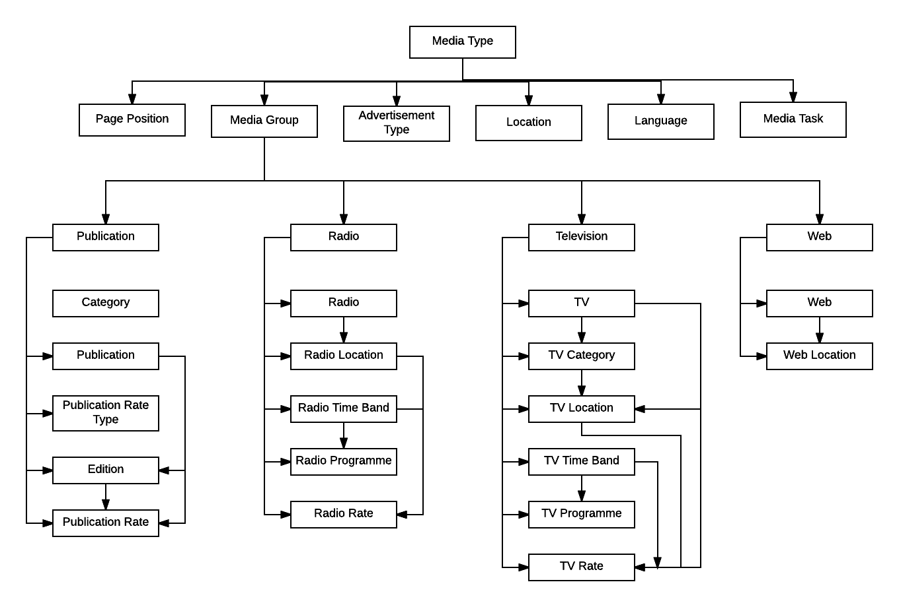

Introduction - Masters
----------------------

CoreERP Publication Module provides the interface for the successful recording, storage and presentation of Enterprise information.
Following is the list of masters available in CoreERP Publication Module.

**Media Group**

Media groups are media houses which have various media under them. There is hierarchy in which media groups are at highest levels. Under media groups come media like the times of India, Economic Times etc. Under media there are various editions like Times of India Delhi edition, Mumbai Edition etc.

Menu Path - Media -> Masters -> Media Group.

Advertisement Type
~~~~~~~~~~~~~~~~~~~~

Advertisements are segregated on the basis of the purpose or message that is spread through them. These could be categorised as appointment, Notice, Tender, Display etc. The charges may differ for different types of advertisement.

Menu Path - Media -> Masters -> Advertisement Type.

Page Position
~~~~~~~~~~~~~~~

Each advertisement has to appear on a particular page and position. Depending on the page and position on which it is printed the tariffs vary. More conspicuous and strategic positions command higher rates. Therefore, it is neccessary to first enter all the page and position details in the system.

Menu Path - Media -> Masters -> Page Position.

Language
~~~~~~~~~

Location
~~~~~~~~~

Location is the place from where an edition is published. Locations have to be specified before an edition can be created for a publication.

Menu Path - Media -> Masters -> Location.

Media Task
~~~~~~~~~~~~

