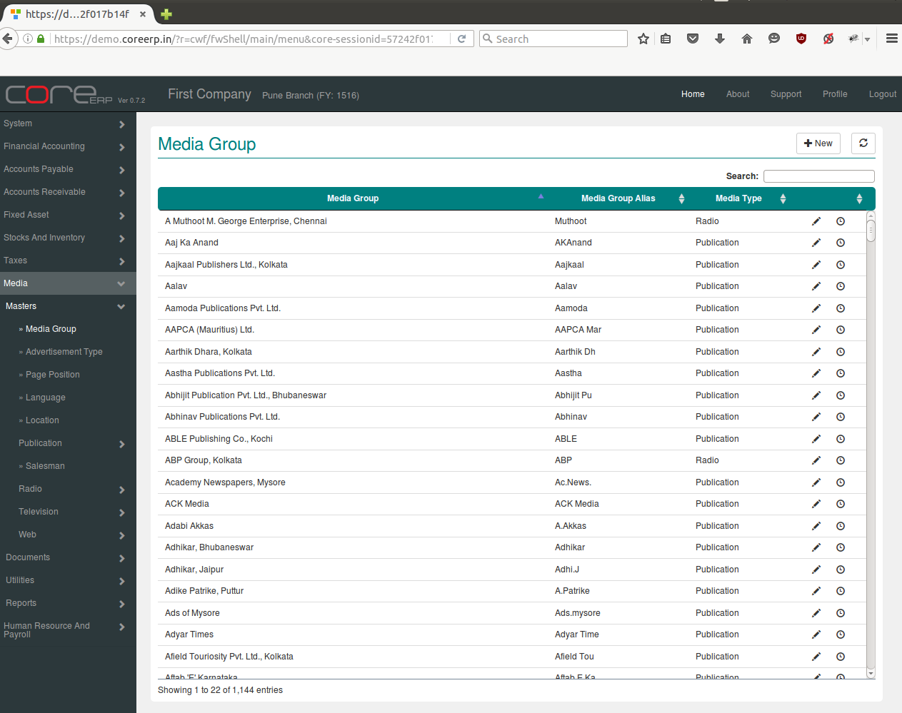
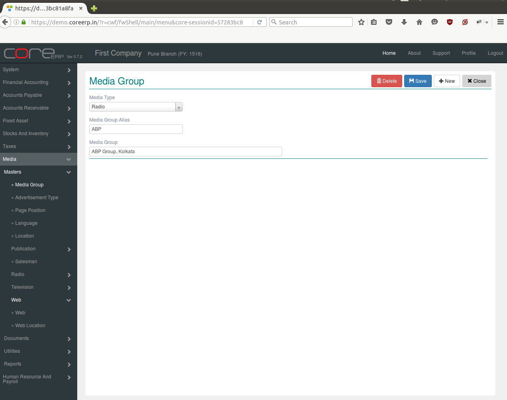

.. |newImage| image:: images/button-new.png
.. |saveImage| image:: images/button-save.png

Media Group
------------

Media groups are media houses which have various media under them. There is hierarchy in which media groups are at highest levels. Under media groups come media like the times of India, Economic Times etc. Under media there are various editions like Times of India Delhi edition, Mumbai Edition etc.

Click on the menu *Media -> Masters -> Media Group*.

The following screen should appear. This is the Media Group Collection.

You can create a new Media Group by clicking on |newImage|

The fields are explained in the following table:

=======================		 =============   ===============================================
Field Name          		 Required        Description
=======================		 =============   ===============================================
Media Type       		 Yes             Select Media Type (e.g. Publication, Radio, Television, Web).
Media Group Alias                Yes       	 Enter Media Group Alias e.g. Aajkaal, ABP etc.
Media Group                 	 Yes             Enter Media Group e.g. Aaj Ka Anand, The India group etc.
=======================		 =============   ===============================================

Click on |saveImage| to save your changes.

