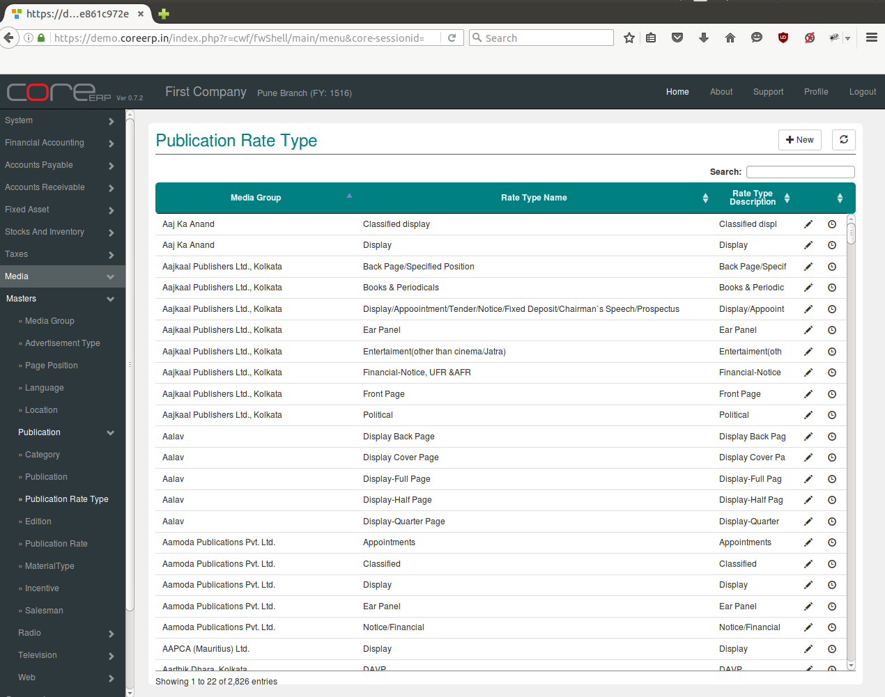
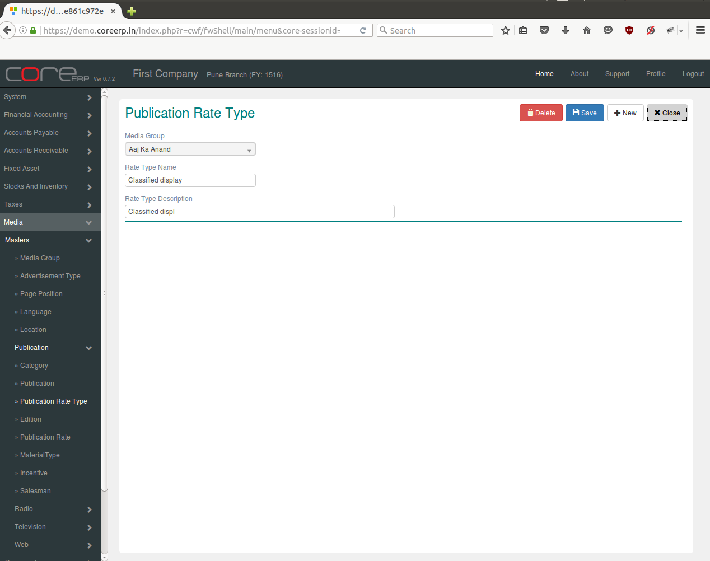

.. |newImage| image:: images/button-new.png
.. |saveImage| image:: images/button-save.png

Publication Rate Type
---------------------

Every Publication has it own rates for different types of advertisement. These rates are specified in tariff card.

Click on the menu *Media -> Masters -> Publication -> Publication Rate Type*.

The following screen should appear. This is the Publication Rate Type Collection.

You can create a new Publication Rate type by clicking on |newImage|

The fields are explained in the following table:

=======================		 =============   ===============================================
Field Name          		 Required        Description
=======================		 =============   ===============================================
Media Group       		 Yes             Select Media Group e.g. All India Radio, ABP Group etc.
Rate Type Name                   Yes             Enter Rate Type Name e.g. Display, Ear Panel etc.
Rate Type Description            Yes             Enter Langauge e.g Display, Ear Panel etc.
=======================		 =============   ===============================================

Click on |saveImage| to save your changes.

