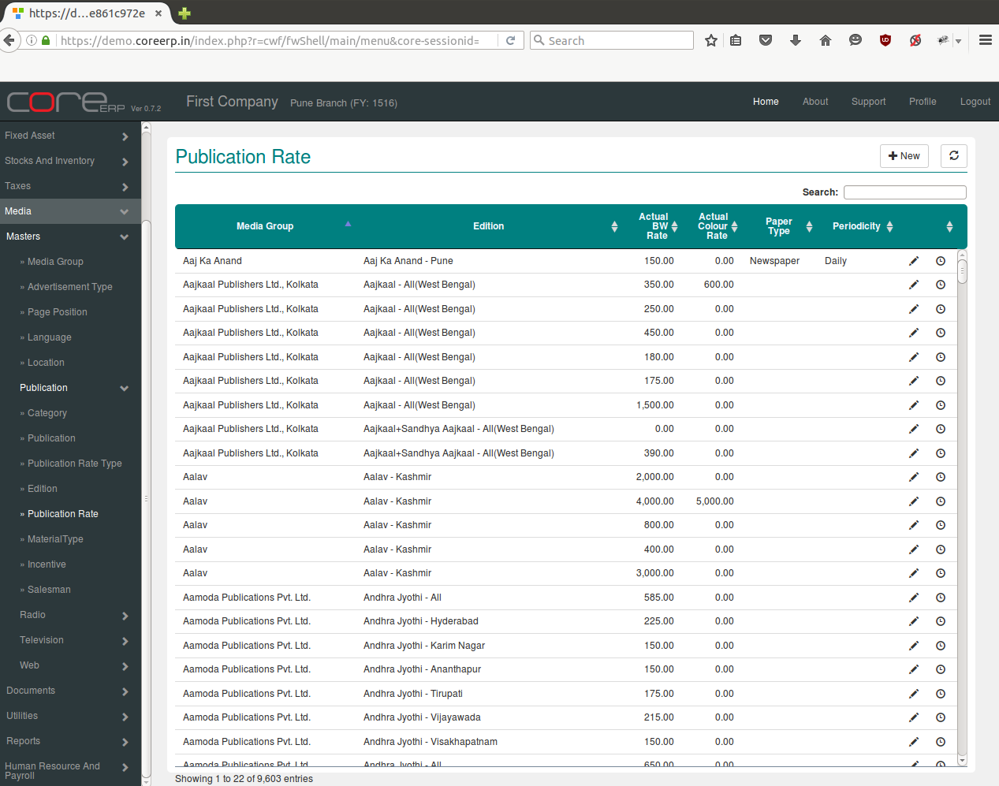
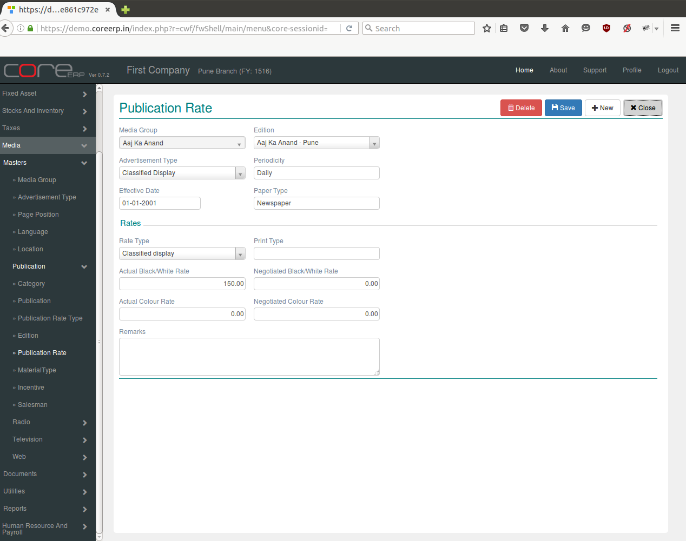

.. |newImage| image:: images/button-new.png
.. |saveImage| image:: images/button-save.png

Publication Rate
----------------

Rate for publishing an advertisement depends on the size and type of the advertisement, the page and position, the publication and edition in which it is published. Each publication group has its own tariffs for publishing an advertisement. These rates have to be fed into the system, so that they can be used to create relaase Orders and bills. Rates are always applicabl from a particaular date and continue to remain valid until a new rate of the same type is entered. Rates once entered cannot be deleted. However, they can be modified.

Click on the menu *Media -> Masters -> Publication -> Publication Rate*.

The following screen should appear. This is the Publication Rate Collection.

You can create a new Publication Rate by clicking on |newImage|

The fields are explained in the following table:

=======================		 =============   ===============================================
Field Name          		 Required        Description
=======================		 =============   ===============================================
Media Group       		 Yes             Select Media Group e.g. All India Radio, ABP Group etc.
Edititon                 	 Yes             Select Editition e.g. Aaj ka anand, Sandyanand etc.
Advertisement Type               Yes             Select Advertisement type e.g. Classified, Appoinment etc.  
Periodicity                      No              Period for which advertisement to be publitioned.
Effective Date                   No              The Effective Date. By default, the system date is taken as effective Date.
Paper Type			 No              Enter Paper Type e.g. Newspaper etc.
Rate Type                        Yes	         Select Rate Type e.g. Classified Display, Display etc.
Print Type 			 No              Enter Print Type
Actual Black/White Rate          No              Enter Actual rate amount
Negotiated Black/White		 No   		 Enter Negotiated rate amount
 Rate     			               
Actual Colour Rate               No              Enter Acutal rate 
Negotiated Colour Rate           No              Enter Negotiated rate 
Remarks                          No              Enter Remarks/Comments 
=======================		 =============   ===============================================

Click on |saveImage| to save your changes.

