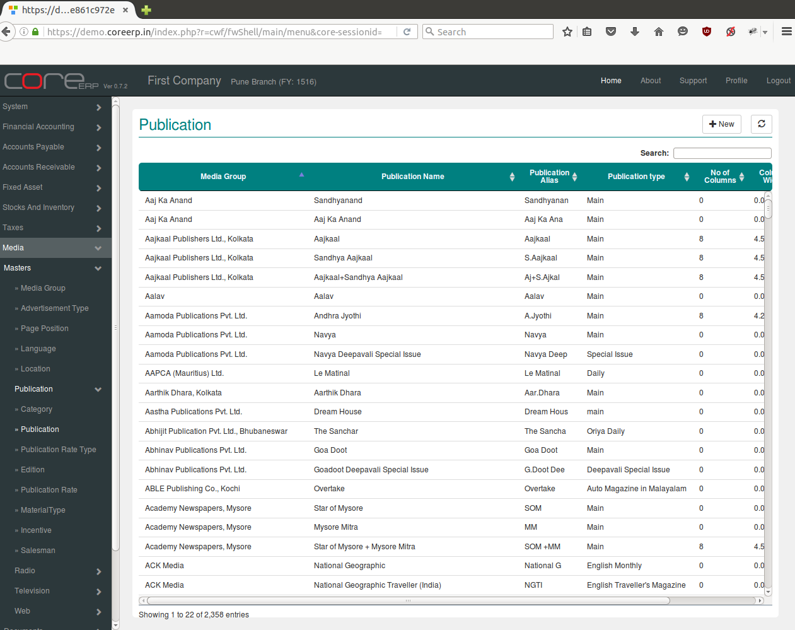
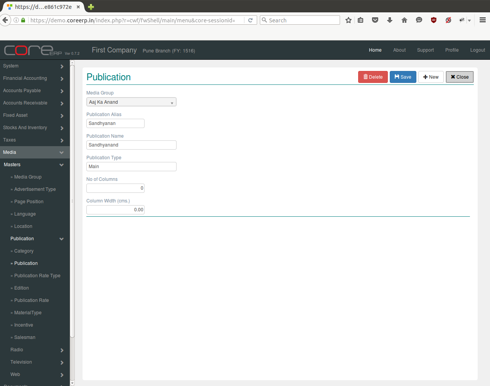

.. |newImage| image:: images/button-new.png
.. |saveImage| image:: images/button-save.png

Publication
-----------

Publication are distributers of copies of newspaper to the public. Publications works under various media groups.  

Click on the menu *Media -> Masters -> Publication -> Publication*.

The following screen should appear. This is the Publication Collection.

You can create a new Publication by clicking on |newImage|

The fields are explained in the following table:

=======================		 =============   ===============================================
Field Name          		 Required        Description
=======================		 =============   ===============================================
Media Group       		 Yes             Select Media Group e.g. All India Radio, ABP Group etc.
Publication Alias                Yes             Enter Publication Alias e.g. 94.3 FM, AIR etc. 
Publication Name		 Yes		 Enter Publication Name e.g. Aajkaal, Dream House etc. 
Publication Type                 Yes             Enter publication Type e.g. Oriya Daily etc.
No of Columns                    No              Enter column numbers
Column width(cms.)               No              Enter column width in cms.
=======================		 =============   ===============================================

Click on |saveImage| to save your changes.

