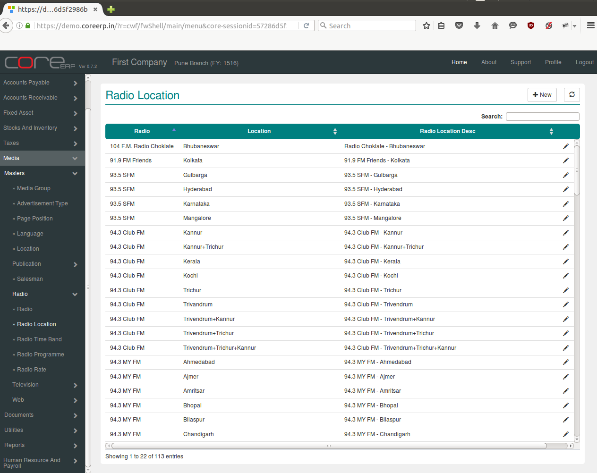
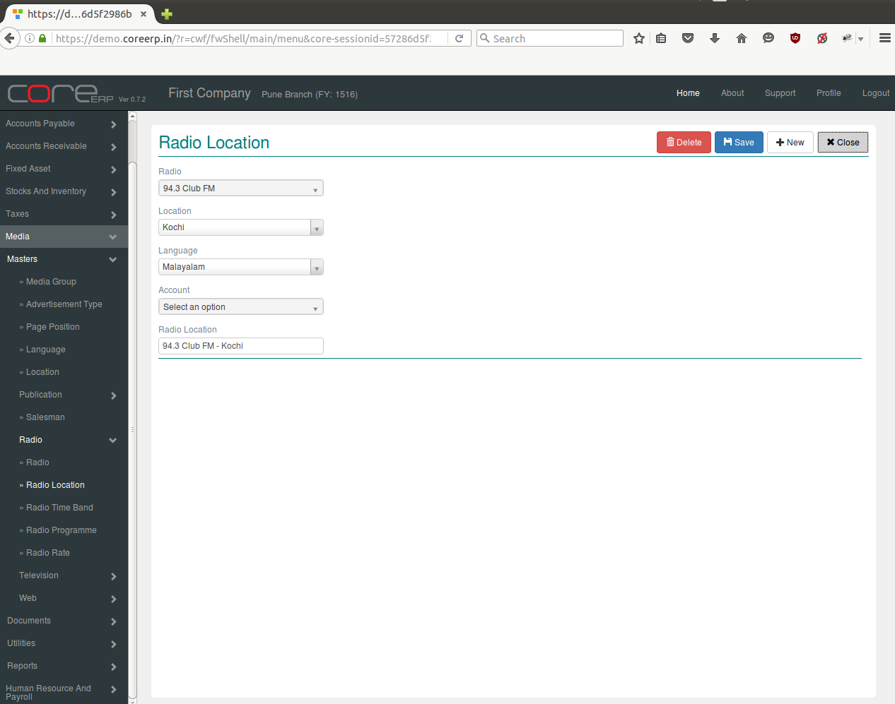

.. |newImage| image:: images/button-new.png
.. |saveImage| image:: images/button-save.png

Radio Location
--------------

Radio location is place of radio from where it is broadcasted.

Click on the menu *Media -> Masters -> Radio -> Radio Location*.

The following screen should appear. This is the Radio Location Collection.

You can create a new Radio Location by clicking on |newImage|

The fields are explained in the following table:

=======================		 =============   ===============================================
Field Name          		 Required        Description
=======================		 =============   ===============================================
Radio      		         Yes             Enter Radio e.g. 95 FM, Akashavani etc.
Location                       	 Yes             Select Location e.g. Pune, Kochi etc.
Langauge                	 Yes             Enter Langauge e.g english, hindi, marathi etc.
Account 			 Yes		 Select Account
Radio Location                   Yes             Enter radio location like 94.3 FM - Kochi, 94.3 Club FM - Trichur etc.
=======================		 =============   ===============================================

Click on |saveImage| to save your changes.

