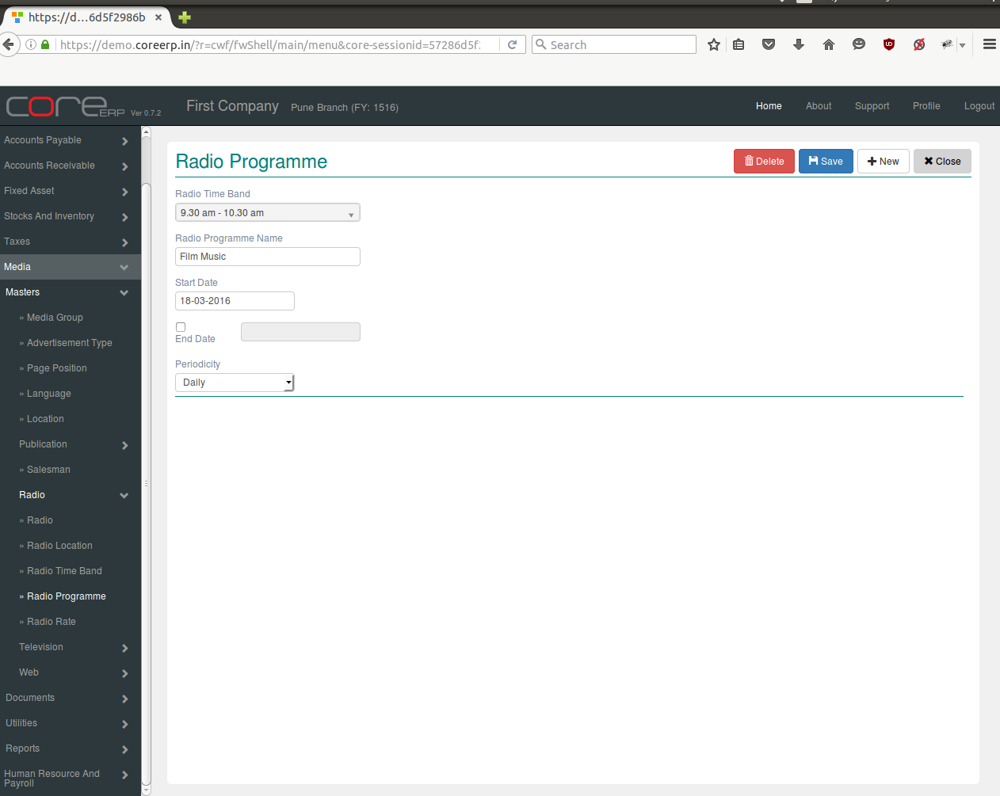

.. |newImage| image:: images/button-new.png
.. |saveImage| image:: images/button-save.png

Radio Programme
---------------

Radio Programme in which the advertisement has been broadcasted.

Click on the menu *Media -> Masters -> Radio -> Radio Programme*.

The following screen should appear. This is the Radio Programme Collection.

You can create a new Radio Programme by clicking on |newImage|

The fields are explained in the following table:

=======================		 =============   ===============================================
Field Name          		 Required        Description
=======================		 =============   ===============================================
Radio Time Band       		 Yes             Select Radio Time Band
Radio Programme Name             Yes             Enter Radio Programme Name e.g. ROS, Film Music etc.
Start Date                	 Yes             The Start Date. By default, the system date is taken as Start Date.
						 Note : The date should be within the constraints of the Financial Year.
End Date             	 	 Yes             The end date. Date at programme ends.  
Periodicity        	 	 No              Select this option either Daily Or Weekly depend on programme requirment.
=======================		 =============   ===============================================

Click on |saveImage| to save your changes.

