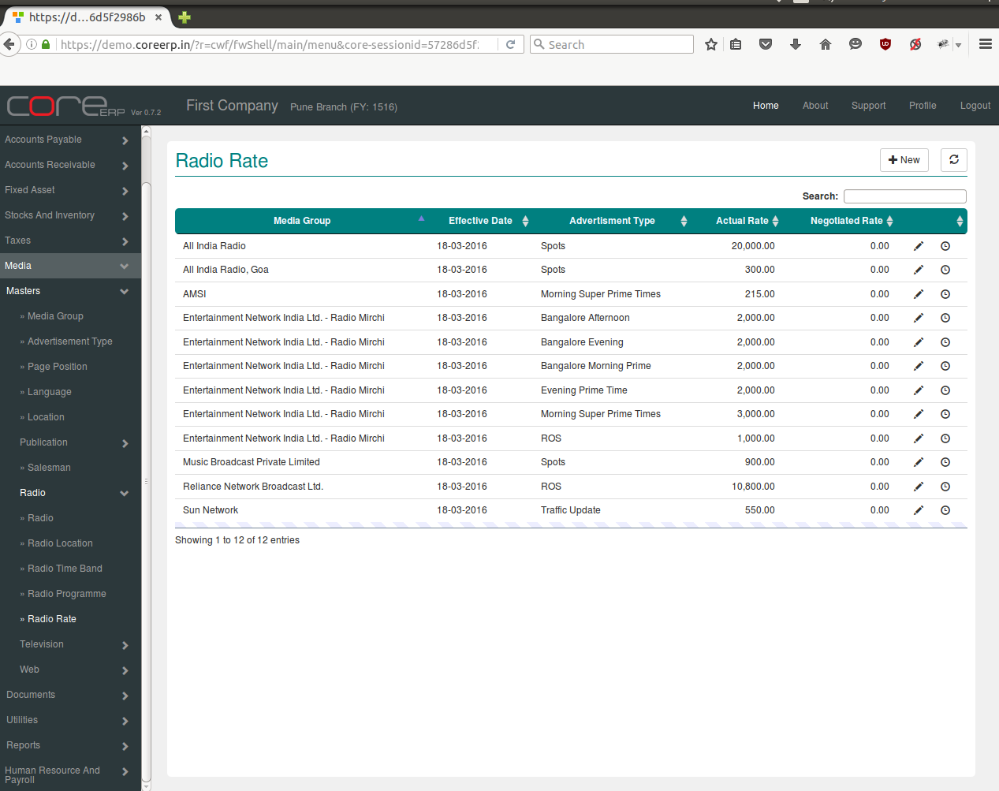
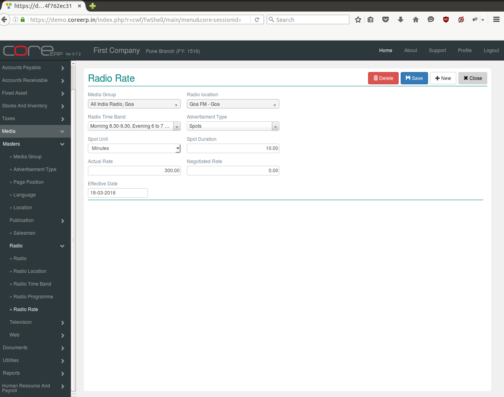

.. |newImage| image:: images/button-new.png
.. |saveImage| image:: images/button-save.png

Radio Rate
----------

Click on the menu *Media -> Masters -> Radio -> Radio Rate*.

The following screen should appear. This is the Radio Rate Collection.

You can create a new Radio Rate by clicking on |newImage|

The fields are explained in the following table:

=======================		 =============   ===========================================================================
Field Name          		 Required        Description
=======================		 =============   ===========================================================================
Media Group      		 Yes             Select Media Group e.g. All India Radio, ABP Group etc.
Radio Location                   Yes             Select Location e.g. Pune, Kochi etc.
Radio Time Band                  Yes             Select Time Band 
Advertisement Type               Yes             Advertisement type are Appointment, Notice, Tender etc.
Spot Unit                        No              Select Spot Unit e.g.Minutes, Hours, Seconds etc. 
Spot Duration                    No              Period of advertisement    
Actual Rate                      No              Rate in amount for advertisement 
Negotiated Rate                  No              Rate in amount 
Effective Date                   No              The Effective Date. By default, the system date is taken as Effective Date.
						 Note : The date should be within the constraints of the Financial Year. 
=======================		 =============   ===========================================================================

Click on |saveImage| to save your changes.

