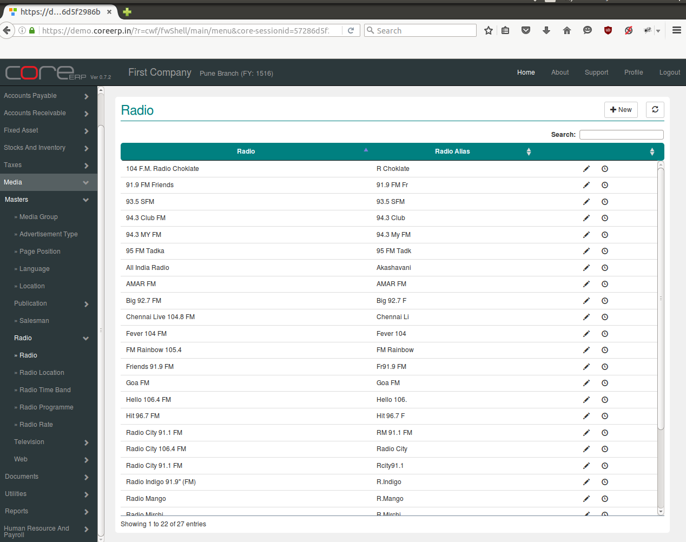
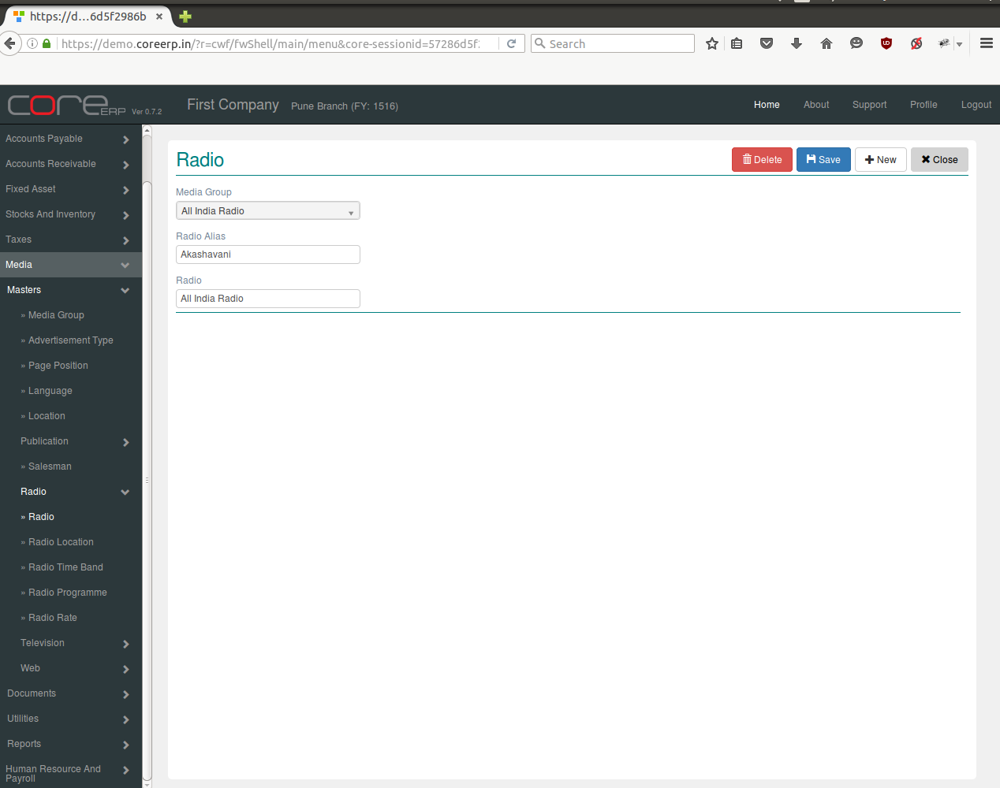

.. |newImage| image:: images/button-new.png
.. |saveImage| image:: images/button-save.png

Radio
-----

Radio is a verbal advertisement media group. 

Click on the menu *Media -> Masters -> Radio -> Radio*.

The following screen should appear. This is the Radio Collection.

You can create a new Radio by clicking on |newImage|

The fields are explained in the following table:

=======================		 =============   ===============================================
Field Name          		 Required        Description
=======================		 =============   ===============================================
Media Group       		 Yes             Select Media Group e.g. All India Radio, ABP Group etc.
Radio Alias                	 Yes             Enter Radio Alias e.g. 94.3 FM, AIR etc. 
Radio				 Yes		 Enter Radio e.g. 95 FM, Akashavani etc. 
=======================		 =============   ===============================================

Click on |saveImage| to save your changes.

