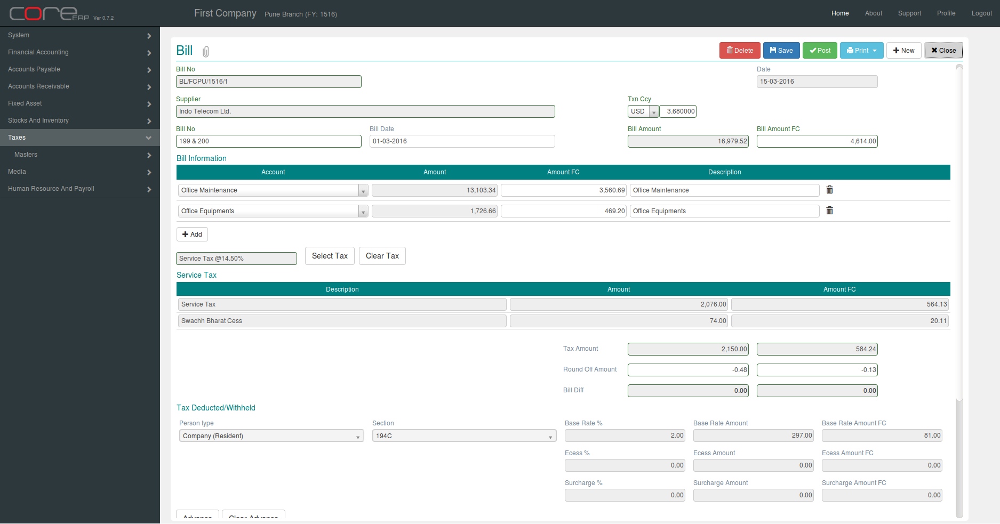

.. |saveImage| image:: images/button-save.png
.. |newImage| image:: images/button-new.png
.. |selectTaxImage| image:: images/button-select-tax.png

Bill
--------

Click on the menu *Accounts Payable -> Documents -> Bill*.

This will show the Bill Collection.

You can create a new Bill by clicking on |newImage|. This is wizard. 

Step 1 : Select Supplier and Document Date.

Final Step : 

The fields are explained in the following table:

==========================		=============   ===============================================
Field Name          			Required        Description
==========================		=============   ===============================================
Bill No		    			No              This is a system generated field. 
               	         	      	 		(*Format - VoucherAlias/Branch Alias/FinYear Alias/Sequence Number*)
Date                			Yes             The Voucher Date. By default, the system date is taken as Voucher Date.
							Note : The date should be within the constraints of the Financial Year.
Supplier            			Yes             Supplier Name (from step 1)
Txn Ccy		    			Yes		Trasaction Currency. Default is *Local*. If Txn Ccy is not Local, enter the exchange rate for the selected currency.
Bill No		    			Yes             
Bill Date	    			Yes		Bill Date. By default, the system date is taken as Bill Date.
Bill Amount/Bill Amount FC	 	Yes		Bill Amount
Account
Amount/Amount FC
Description
==========================		=============   ===============================================

Click |selectTaxImage| to apply Tax.

.. image:: images/bill-select-tax.png

Advance

Click on |saveImage| to save your changes and close. The Bill Collection will now display the newly created Bill.

