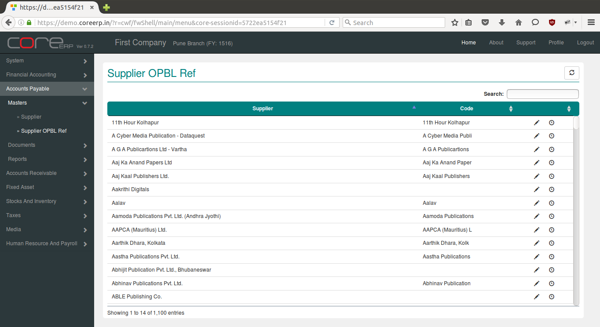
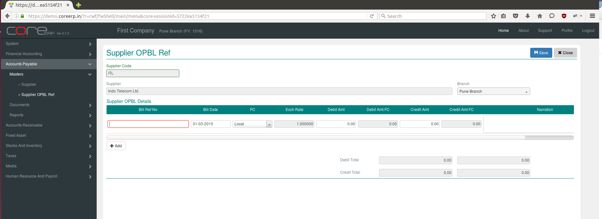

.. |saveImage| image:: images/button-save.png
.. |newImage| image:: images/button-new.png

Supplier OPBL Ref
-----------------

This enables the users to enter Opening Balance References for vouchers in respect of suppliers.
This is usefule in the first year of system installation when references need to be entered in respect of bills pending tyo Suppliers.

Click on the menu *Accounts Payable -> Masters -> Supplier OPBL Ref*.

This will show the Supplier Collection.

You can edit supplier to add Opening Balance References.

The fields are explained in the following table:

==================  =============   ===============================================
Field Name          Required        Description
==================  =============   ===============================================
Supplier Code       No              Code for supplier
Supplier            Yes             Supplier Name
Branch		    Yes             This shows the currently connected branch.
Bill Ref No	    Yes		    Bill Reference Number.
Bill Date     	    Yes		    Bill Date. The bill date should be less than the Year Begins of the connected Financial Year.
FC	            Yes             Select currency for the opening balance. By default it is *Local*
Exch Rate	    Yes             Select Exchange Rate for the Foreign Currency. For local exch rate is 1.
Debit Amt	    No              Required if currency is *Local* and *Credit Amt* is *Zero*.
Debit Amt FC        No              Required if currency is not *Local* and *Credit Amt FC* is *Zero* .
Credit Amt          No              Required if currency is *Local* and *Debit Amt* is *Zero* .
Credit Amt FC       No              Required if currency is not *Local* and *Debit Amt FC* is *Zero* .
Narration           No	            Narration
==================  =============   ===============================================

Click on |saveImage| to save your changes and close.

