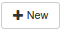
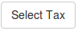
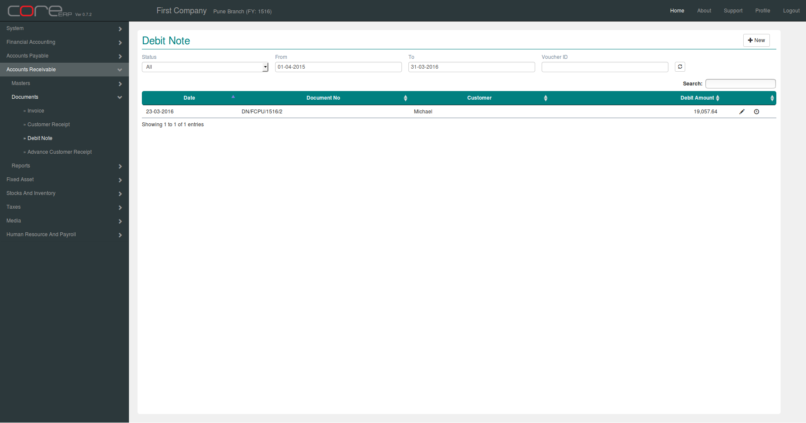
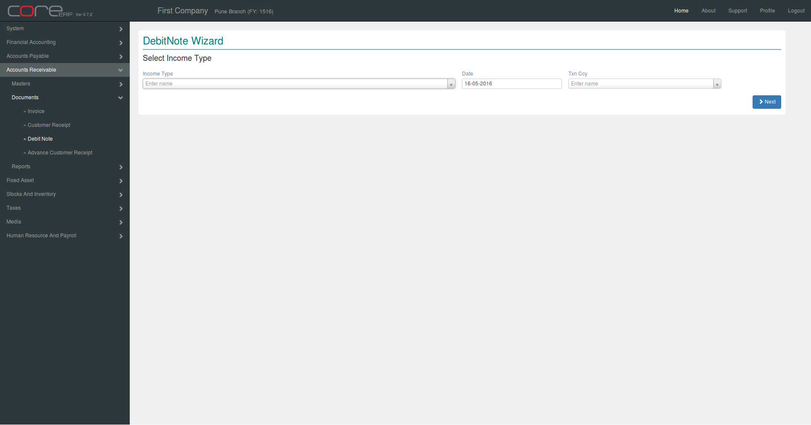
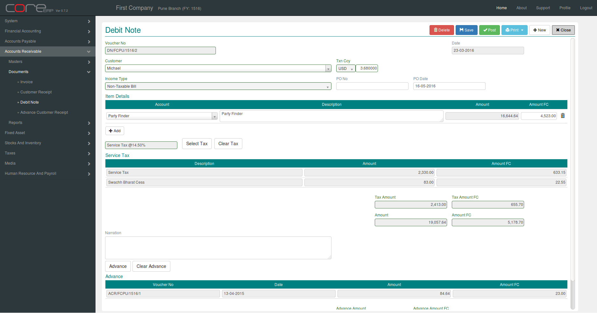
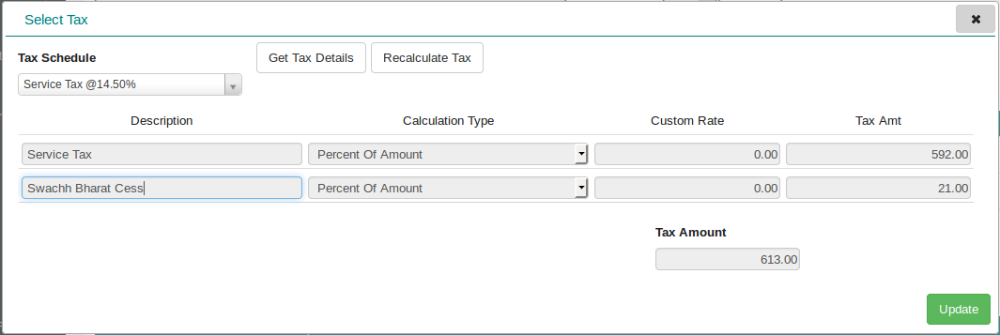
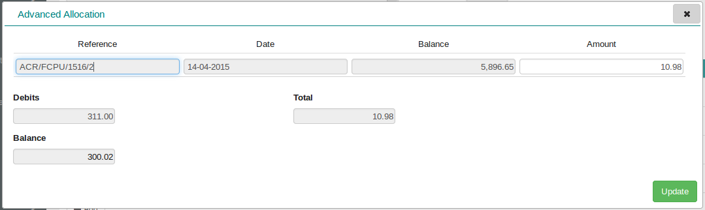

.. |saveImage| image:: images/button-save.png

Debit Note
-----------

Click on the menu *Accounts Receivable -> Documents -> Debit Note*.

This will show the Debit Note Collection.

You can create a new Debit Note by clicking on |newImage|. This is wizard. 

Step 1 : Select Income Type, Document Date and Txn Ccy.

Final Step : 

The fields are explained in the following table:

==========================		=============   ===============================================
Field Name          			Required        Description
==========================		=============   ===============================================
Voucher No		    		No              This is a system generated field. 
               	         	      	 		(*Format - VoucherAlias/Branch Alias/FinYear Alias/Sequence Number*)
Date                			Yes             The Voucher Date. By default, the system date is taken as Voucher Date.
							Note : The date should be within the constraints of the Financial Year.
Customer            			Yes             Customer Name
Txn Ccy		    			Yes		Trasaction Currency. Default is *Local*. If Txn Ccy is not Local, enter the exchange rate for the selected currency.
Income Type	    			Yes             Income Type (From Step 1)
PO NO					No		Purchase Order Number.
PO Date		    			Yes		Purchase Order Date. By default, the system date is taken as PO Date.
Bill Amount/Bill Amount FC	 	Yes		Bill Amount
Account					Yes
Description				Yes
Amount/Amount FC			Yes

==========================		=============   ===============================================

Click |selectTaxImage| to apply Tax.

Advance

Click on |saveImage| to save your changes and close. The Debit Note Collection will now display the newly created Debit Note.

