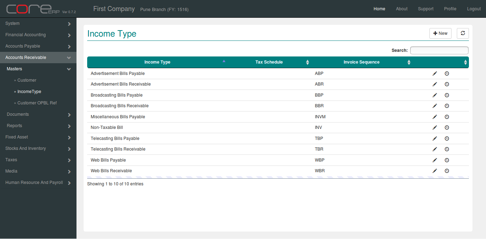
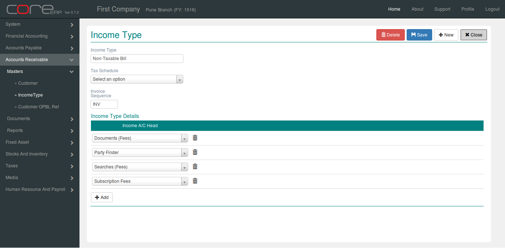

.. |saveImage| image:: images/button-save.png
.. |newImage| image:: images/button-new.png

Income Type
------------

Click on the menu *Accounts Receivable -> Masters -> Income Type*.

This will show the Income Type Collection.

You can create a new Income Type by clicking on |newImage|.

The fields are explained in the following table:

==================  =============   ===============================================
Field Name          Required        Description
==================  =============   ===============================================
Income Type	    Yes             Income Type Name
Tax Schedule        No              This is the default tax schedule for the supplier.
Invoice Sequence    Yes             This is the default tax schedule for the supplier.
Income A/C Head     Yes
==================  =============   ===============================================

Click on |saveImage| to save your changes and close. The Income Type Collection will now display the newly created Income Type.

