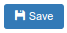

.. |newImage| image:: images/button-new.png

Getting Started
===============

CoreERP is a web based application that can be opened in using any web browser. 
Even though it has been tested and found to be performing with all latest browsers 
available in the market, the following browsers are recommended for a smooth and 
pleasant user experience.

    - Mozilla Firefox
    - Google Chrome
    - Internet Explorer 11 (subject to a few known issues)

Please ensure that you have the latest version of the browser. 

Site and Login
--------------

To start with, open the link provided by the welcome mail in your favourite browser.  ::

    http://<your-sub-domain>.coreerp.net or http://<your-sub-domain>.coreerp.in

If your site is locally published, then get the site address from your local administrator.

A typical login screen would appear like this:

    .. image:: images/login.png

Enter the **Username** and **Password** provided in the welcome mail. If your authentication credentials were correct, it should take you to the next screen. 
In this screen, you would select the *Company*, *Branch* and *Financial Year*. 

    .. image:: images/select-company.png

* **Company:** This is the legal entity of the organisation. If you are a registered user in multiple companies, this would list all the companies that you can connect to.

* **Branch:** This is a physical/geographical location within the selected *company*. If you have access to multiple branches within the selected *company*, all *branches* would be listed here.

* **Financial Year:** This is the *Financial Year* for which you wish to open your books of accounts. Only *Financial Year(s)* created for the selected *company* and *Open* would be listed here.

First, click on the **Company**. It's background would change to selected, and a list of *branches* would appear.

Click on the desired **Branch**. It would display a list of *Financial Year(s)*. Now, select the **Financial Year** and you would be taken to the *Home Page*.

A brief on the Home Page
------------------------

After selection of *Company -> Branch -> Financial year*, you will be welcomed by the home page, similar to the following image.

    .. image:: images/home-page.png

If we start from the left hand top corner, we see the CoreERP logo. Clicking on this logo, will take you to the *Company -> Branch -> Financial year* selection. You can change your selection without logging out of the system.

Just below the logo, would be the *menus*. The *menus* are loaded based on the access level assigned to the user and the modules activated in the system. Any new activity in CoreERP starts from these menus.

The text, right beside the logo displays the *Company, Branch and Financial Year* that you are connected to. 

There are a few quick links on the right hand side. Clicking on *Home* brings you to this home page. 

**About** provides a brief about the organisation that is behind the development and maintenance of CoreERP.

**Support** can be used to submit any issue relating to CoreERP. The system would automatically generate a ticket and connect the issue to the support/maintenance team. Do remember to use this if you run into problems using the system.

**Profile** lets you change your password and other user settings.

Clicking on **Logout** would log you out of the system and return you to the login page. Remember to click this after you have completed your work and would like to exit the system.

Let us browse and explore
-------------------------

Every Business Entity or Legal Entity is defined as a **Company** in CoreERP. All the masters like Chart Of Accounts, Suppliers, Customers, etc. belong to a company. It is the root for all financial transactions in a predefined financial period. Every company requires to have at least one `Branch <branch>` and one `Financial Year <finyear>` to begin with. Business transactions are recorded as part of the branch and belong to a financial year. 

    - Let us click on the first menu **System** and expand it. 
    - Click **Support**. This would display a collection/list as follows:

    .. image:: images/sample-collection.png

Clicking on a menu item in master or document always brings up a list. The left top mentions the name of the list.
On the right hand side you will see two buttons. 

    .. image:: images/button-add-refresh.png

    - The first |addImage| button stands for adding a new item.
    - The second |refreshImage| button can be clicked to refresh the list.
    - The search text box accepts any input and filters the list for the entered text. This is helpful when you have large lists to filter/search.

Click on the |addImage| button. It will display a combination of labels and text boxes for data entry. Usually all fields are compulsory. Setting the cursor on a field and hitting the **tab** key, displays a validation message if the field is required.  

    .. image:: images/support-issue.png

    - The caption displays the list being edited
    - The three buttons on the right hand side, display the actions allowed to the user. 

    .. image:: images/saveNewCloseButton.png

    - Clicking on |saveImage| will save the item/document to the database on the server
    - |newImage| is to add a new item
    - |closeImage| is to close the edit screen and return to list view

Click on **Close** to return to the list.

