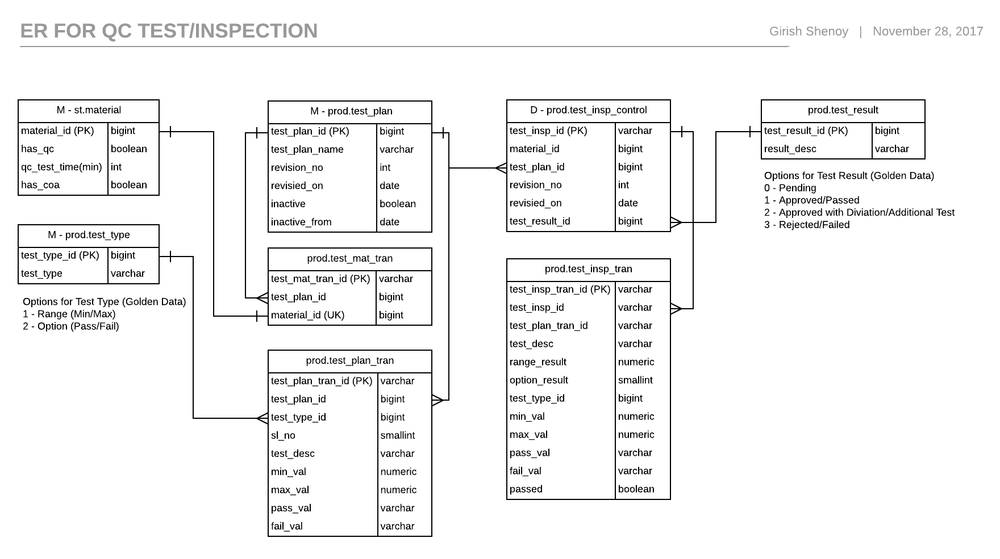

Introduction
------------

CoreERP Production and Quality Control modules are complementary to each other. Any production process must be closely monitored and accompanied
by quality control.

Presently, quality control module is available for recording transactions independent of Production Process. At a later stage, this would be
integrated with Production.

To make a material/stock item subject to Quality Checks, a new tab *QC Info* has been introduced in Stock Item Master. 
Check QC Required and enter timeout for enabling Quality Checks on Inventory Items.

Further, you would be required to create a Test Plan and record relevant test results in Test/Inspection documents. 
This is explained in the next topic.

The following is the ER diagram of QC objects

