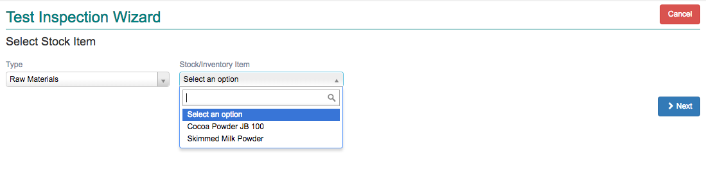

Test/Inspection
---------------

Test or Inspection conducted on a Material or Stock Item is recorded in this document. Upon creating of a Test Plan and association of the same
with material/stock item, the Test/Inspection document can be started from the wizard.

Click the menu *Production -> Documents -> Test/Inspection* to view collection of already created documents. 

Click *+ New* button to start creating a new Test/Inspection document. It will start a wizard.

Select the Stock Item for which you plan to create the Test/Inspection. Only Stock Items associated with an existing Test Plan will 
appear in this wizard.

You may use the Stock Type to filter the list of stock items or directly select a stock item. Select the material and Click *Next*.

The document screen opens with the following:

.. image:: images/test-insp.png

-   Standard Tests
    All tests grouped together as standard test should be completed before the material/stock item is Accepted/Rejected

-   Additional Tests
    Any of the additional tests can be selected by the user and applied to a material/stock item during Test/Inspection

The fields are explained in the following table:

=======================		 =============   ===============================================================================
Field Name          		 Required        Description
=======================		 =============   ===============================================================================
Date                             Yes             Document date
Supplier/Mfg               	 Yes             Name of Supplier/Manufacturer
Bill/Inv No			 Yes		 Bill/Invoice Number accompanying the material/stock shipment
Bill Date                        Yes             Bill Date
Sample Qty                       Yes             Sample quantity taken for testing
*Standard Tests*
Description        	 	 Read Only       Name of the individual test
Std. Result        		 Read Only       Range or Option defined in Test Plan
Conducted                        Yes             Flag to inform that the test is conducted. 
                                                 Allows user to record observation/result
Observation                      Yes             The result of the physical/chemical test conducted
Test Result                      Read Only       Displays whether the test Passed or Failed
Comments                         No              User/Tester can add small comments here
*Additional Tests*                               Follows same rules as Standard Tests
=======================		 =============   ===============================================================================

Complete the Standard Tests. If Additional tests are required, click on *+ Add* and include additional tests.
If you have collected more than one sample and would like to record test results of the second sample, click on *+ Add Sample*.
The standard and additional tests would be repeated for each sample added.

Refer to the Fields table to understand usage of various field types.

You can save the document intermittently without completing all the tests. However, to post and print a final copy all selected tests
must be conducted and results recorded.

At the top right side of the screen you can see the final result of all tests. 

If even one test fails, the Test Result would be *Rejected*.

If all tests were completed as *Passed*, the Test Result would be *Approved*. 

If any of the selected tests are not completed, the test result would be *Pending*.

Save/Post the document if there are no further broken rules.

To print the document select *Actions -> Print*.

