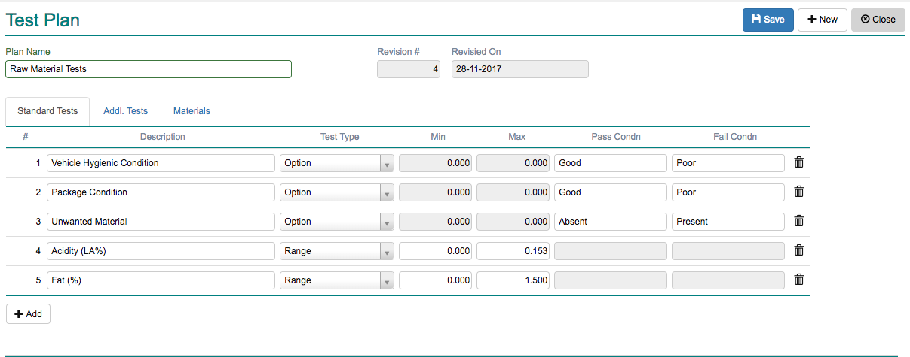
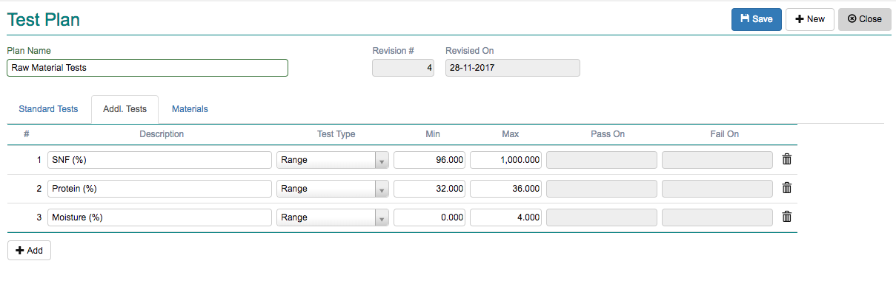
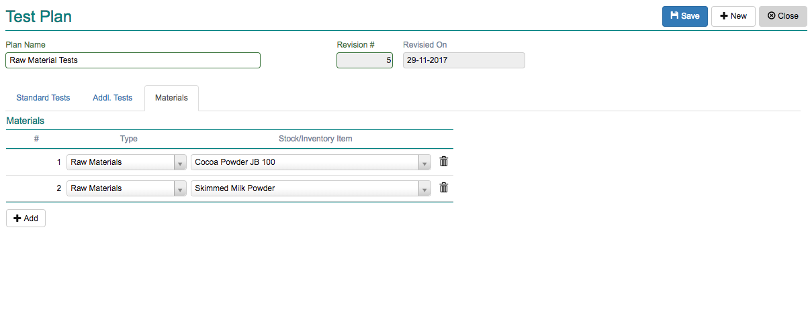

Test Plan
---------

A Test Plan is a template that is created to put together various tests that would be conducted on a specific stock item or a group of materials.
Individual tests are grouped together in a test plan. It consists of 2 distinct types of test groups.

-   Standard Tests
    All tests grouped together as standard test should be completed before the material/stock item is Accepted/Rejected

-   Additional Tests
    Any of the additional tests can be selected by the user and applied to a material/stock item during Test/Inspection

Click on the menu *Production -> Masters -> Test Plan*.

A collection screen appears. Click on the *+ New* button.

The fields are explained in the following table:

=======================		 =============   ===============================================================================
Field Name          		 Required        Description
=======================		 =============   ===============================================================================
Plan Name       		 Yes             A unique name given to the Test Plan
Revision #               	 System          This is automatically generated by the system every time you save the plan.
Revised On			 System		 The system data is automatically recorded.
*Standard Tests*
Description        	 	 Yes             Name of the individual test
Test Type        		 Yes             Can be any one of the following:
                                                 - Range  : Consisting of maximum and minimum values. Must be of type number.
                                                 - Option : Can be either Pass Value or Fail Value.
Min             	 	 Yes             The Minimum value for Range. Enabled only when Range is selected as test type.
Max             	 	 Yes             The Maximum value for Range. Enabled only when Range is selected as test type.
Pass Cond                  	 Yes             The value to be selected if the observation is "Passed".  
Fail Cond                  	 Yes             The value to be selected if the observation is "Failed".
*Additional Tests*
Description        	 	 Yes             Name of the individual test
Test Type        		 Yes             Can be any one of the following:
                                                 - Range  : Consisting of maximum and minimum values. Must be of type number.
                                                 - Option : Can be either Pass Value or Fail Value.
Min             	 	 Yes             The Minimum value for Range. Enabled only when Range is selected as test type.
Max             	 	 Yes             The Maximum value for Range. Enabled only when Range is selected as test type.
Pass Cond                  	 Yes             The value to be selected if the observation is "Passed".  
Fail Cond                  	 Yes             The value to be selected if the observation is "Failed".
=======================		 =============   ===============================================================================

The screen has 3 tabs. 

Standard Tests
~~~~~~~~~~~~~~
All standard tests are required to be completed by the user during Test/Inspection Report.

Click on the *+ Add* button and include as many standard tests as required. 

Refer to the Fields table to understand usage of various field types.

Additional Tests
~~~~~~~~~~~~~~~~
These are optional tests the user can select and apply in Test/Inspection Report.

Materials
~~~~~~~~~
Include the materials here to which test should be applied. A material selected in one test plan cannot again be selected in another. 
Also ensure that the material/stock item has the *QC Test Required* flag set to true in Stock Item master. 
Only then will the stock item appear for selection.

Enter required information and click save. If there are no broken rules, the test plan would be successfully saved.

