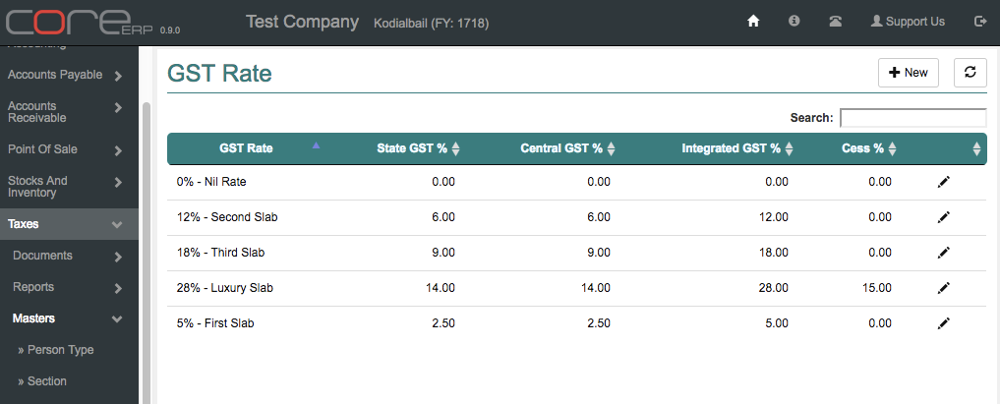

GST Setup Guide
===============

This guide provides the basic guidelines required to be followed and setup GST in CoreERP.

GL Interface for GST
--------------------

We will first start by setting up the following accounts in the Chart Of Accounts. 
You are required to have add/edit rights to *Financial Accounting -> Chart Of Accounts*.

Create the following accounts for Input Tax Credit purposes

======================== ===================== =================================
Account Group            Account Type          Account Head
======================== ===================== =================================
Assets -> Current Assets Other Assets          SGST Input Credit
Assets -> Current Assets Other Assets          CGST Input Credit
Assets -> Current Assets Other Assets          IGST Input Credit
Assets -> Current Assets Other Assets          CESS on GST Input Credit
======================== ===================== =================================

Create the following accounts for recording Tax Collections

===================================== ===================== =================================
Account Group                 	      Account Type          Account Head
===================================== ===================== =================================
Liabilities -> Current Liabilities    Other Liabilities     SGST Collected
Liabilities -> Current Liabilities    Other Liabilities     CGST Collected
Liabilities -> Current Liabilities    Other Liabilities     IGST Collected
Liabilities -> Current Liabilities    Other Liabilities     CESS on GST Collected
===================================== ===================== =================================

Create the following accounts for recording Tax Liability on Reverse Charge

===================================== ===================== ===================================
Account Group                 	      Account Type          Account Head
===================================== ===================== ===================================
Liabilities -> Current Liabilities    Other Liabilities     SGST Payable On Reverse Charge
Liabilities -> Current Liabilities    Other Liabilities     CGST Payable On Reverse Charge
Liabilities -> Current Liabilities    Other Liabilities     IGST Payable On Reverse Charge
Liabilities -> Current Liabilities    Other Liabilities     GST CESS Payable On Reverse Charge
===================================== ===================== ===================================

Create GST Rates
----------------

Presently there are 4 GST rates and one Nil rate. 
Click on *Taxes -> Masters -> GST Rate* 

Create the following rates based on current GST rate. This may change over time and new rates can be created similarly.

GST Rate is 0% Nil Rate

=========== ================= ======================== ================================= ===================================
Rate Type   Percentage        Input Tax Credit A/C     Tax Collection A/C                Reverse Charge Liability
=========== ================= ======================== ================================= ===================================
SGST        0.00              SGST Input Credit        SGST Collected                    SGST Payable On Reverse Charge
CGST        0.00              CGST Input Credit        CGST Collected                    CGST Payable On Reverse Charge
IGST        0.00              IGST Input Credit        IGST Collected                    IGST Payable On Reverse Charge
Cess        0.00              CESS on GST Input Credit CESS on GST Collected             GST CESS Payable On Reverse Charge
=========== ================= ======================== ================================= ===================================

GST Rate is 5% First Slab

=========== ================= ======================== ================================= ===================================
Rate Type   Percentage        Input Tax Credit A/C     Tax Collection A/C                Reverse Charge Liability
=========== ================= ======================== ================================= ===================================
SGST        2.50              SGST Input Credit        SGST Collected                    SGST Payable On Reverse Charge
CGST        2.50              CGST Input Credit        CGST Collected                    CGST Payable On Reverse Charge
IGST        5.00              IGST Input Credit        IGST Collected                    IGST Payable On Reverse Charge
Cess        0.00              CESS on GST Input Credit CESS on GST Collected             GST CESS Payable On Reverse Charge
=========== ================= ======================== ================================= ===================================

GST Rate is 12% Second Slab

=========== ================= ======================== ================================= ===================================
Rate Type   Percentage        Input Tax Credit A/C     Tax Collection A/C                Reverse Charge Liability
=========== ================= ======================== ================================= ===================================
SGST        6.00              SGST Input Credit        SGST Collected                    SGST Payable On Reverse Charge
CGST        6.00              CGST Input Credit        CGST Collected                    CGST Payable On Reverse Charge
IGST        12.00             IGST Input Credit        IGST Collected                    IGST Payable On Reverse Charge
Cess        0.00              CESS on GST Input Credit CESS on GST Collected             GST CESS Payable On Reverse Charge
=========== ================= ======================== ================================= ===================================

GST Rate is 18% Third Slab

=========== ================= ======================== ================================= ===================================
Rate Type   Percentage        Input Tax Credit A/C     Tax Collection A/C                Reverse Charge Liability
=========== ================= ======================== ================================= ===================================
SGST        9.00              SGST Input Credit        SGST Collected                    SGST Payable On Reverse Charge
CGST        9.00              CGST Input Credit        CGST Collected                    CGST Payable On Reverse Charge
IGST        18.00             IGST Input Credit        IGST Collected                    IGST Payable On Reverse Charge
Cess        0.00              CESS on GST Input Credit CESS on GST Collected             GST CESS Payable On Reverse Charge
=========== ================= ======================== ================================= ===================================

GST Rate is 28% Luxury Slab

=========== ================= ======================== ================================= ===================================
Rate Type   Percentage        Input Tax Credit A/C     Tax Collection A/C                Reverse Charge Liability
=========== ================= ======================== ================================= ===================================
SGST        14.00             SGST Input Credit        SGST Collected                    SGST Payable On Reverse Charge
CGST        14.00             CGST Input Credit        CGST Collected                    CGST Payable On Reverse Charge
IGST        28.00             IGST Input Credit        IGST Collected                    IGST Payable On Reverse Charge
Cess        0.00              CESS on GST Input Credit CESS on GST Collected             GST CESS Payable On Reverse Charge
=========== ================= ======================== ================================= ===================================

You may add more slabs based on your requirements and map it to the ledgers accordingly.

It should look like this

Associate GST Rates with HSN/SAC
--------------------------------

This is the final step for GST setup. Here we use the menu *Taxes -> Masters -> HSN Rate*. 
Here, you would find a list of HSN codes available via the GSTN API. To utilise any of these HSN/SAC 
codes, a GST Rate is required to be associated. 

Proceed to select the specific HSN code as per the chapter heading of your product and associate the GST Rate.

